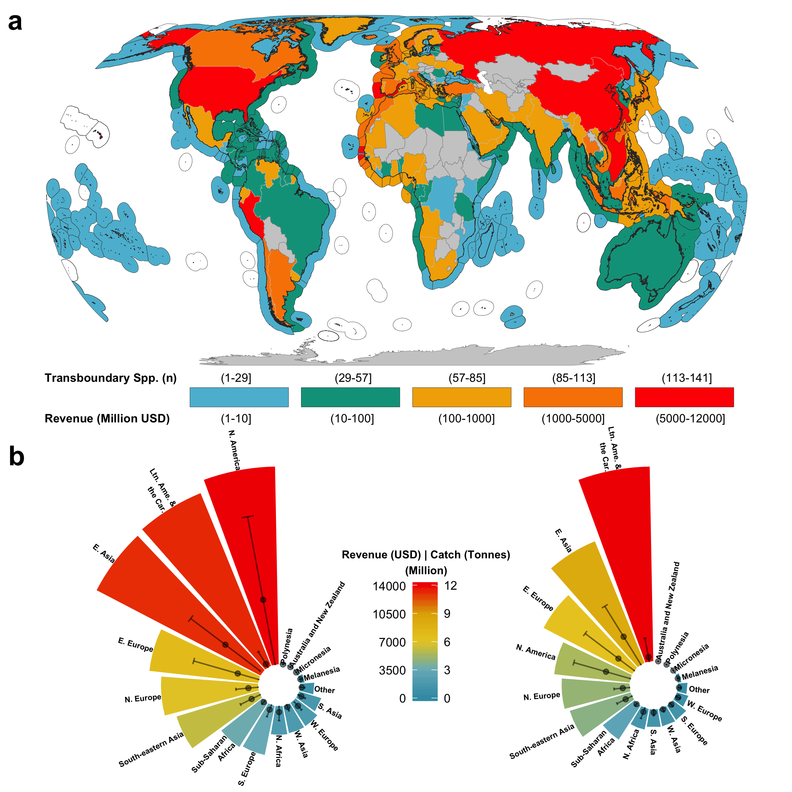
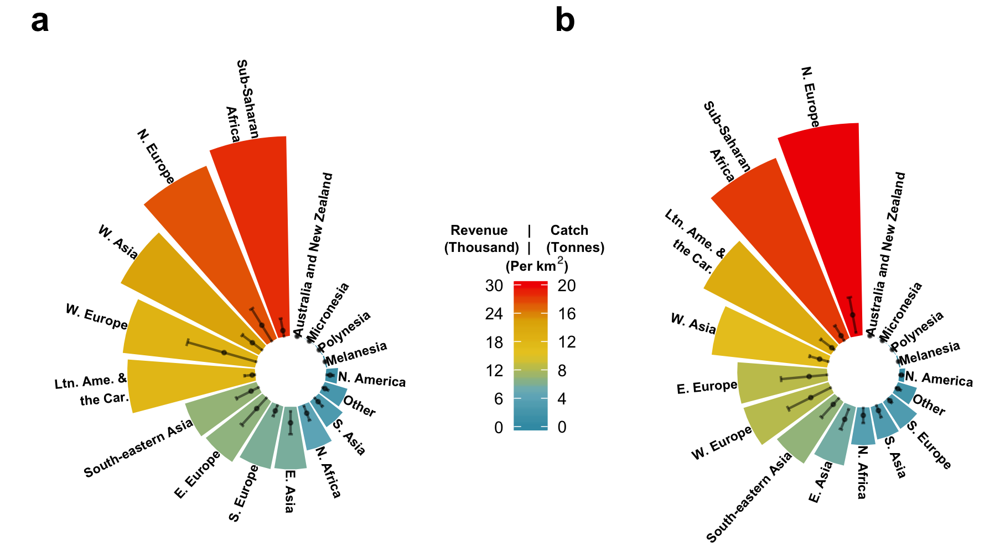
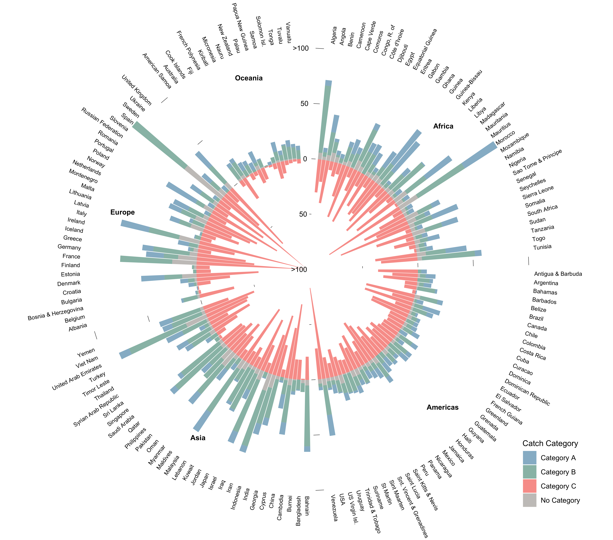

<!-- # Instructions for submission -->

<!-- - Journal: *Science*  -->
<!-- - Information to authors (https://www.sciencemag.org/authors/science-information-authors) -->
<!-- - There are two types of article: -->

<!-- -- **Reports** (up to ~2500 words including references, notes and captions–corresponds to ~3 printed pages in the journal) present important new research results of broad significance. Reports should include an abstract, an introductory paragraph, up to four figures or tables, and about 30 references.  -->

<!-- Policy Forums (1000 to 2000 words, 1-2 figures, and up to 15 references) presents issues related to the intersections between science and society that have policy implications. -->


<!-- In both cases Materials and Methods should be included in supplementary material -->

<!-- --- Instructions for preparing an initial manuscript https://www.sciencemag.org/authors/instructions-preparing-initial-manuscript -->


<!-- - Reviewers: Names, affiliations, and e-mail addresses of up to five potential reviewers and up to five excluded reviewers. -->

# **One Sentence Summary** (~ 125 characters)

<!-- A brief teaser statement highlighting main result of the paper, understandable by a scientist not in your field, without jargon or abbreviations. This will appear online adjacent to the title and should not repeat phrases already present there -->


- Field code: *Fisheries*

# **Abstract** (~125 words)

<!-- An opening sentence that sets the question that you address and is comprehensible to the general reader, background content specific to this study, results, and a concluding sentence. It should be a single paragraph. -->


<!-- # Introduction (~600 words) -->

Species are not randomly distributed in the world. The area in space and time where a stable population lives and reproduces is determined by the species' fitness response to a series of biotic and abiotic factors [@Hunch] and their influence in the evolutaionary process [@REF]. Species distributions are key elements in marine resources management as human-made spatial boundaries are a major part of the management system [@Song:2017iua]. However, incorporating the concept of species distribution has not allays been the case in fisheries management, nor policy. The delimitation of Economic Exclusive Zones (EEZs) virtually splitted the distribution of many species, creating shared species between nations, and adding another level of complexity to fisheries management. However, 40 years after their establishment, the question of how many shared species exists in the world based on their distribution is still unanswered. In here, we show that many species are shared, representing an important contrubution to national economies and food security, and hilighting the importance to aknowledge this in the policy arena.

From 1973 to 1982 the members of the United Nations held a series of meetings to discuss regulations regarding the high seas, a region of international common property, which, at that time, represented waters after 12 miles from shore [@McRae and Munro, 1989]. The stablishment of the UN Convention on the Law of the Sea (UNCLOS) allowed coastal states to claim jurisdiction over 200 nautical miles of their coasts [@UN:1982]. Despite intended to improve fisheries management by granting property rights over shared ressources, this arbitrary delimitation of management area had no input from biogeography; ignoring species distributions created what we know today as shared stocks [@REF]. The Food and Agricultural Organization (FAO) recognizes three types of shared stocks: (*i*) transboundary, those stocks that are shared by 2 or more neighboring coastal nations; (*ii*) straddling, those stocks that are shared by two or more nations and also the high seas; and (*iii*) highly migratory stocks; species that are found in the EEZs of coastal nations that are not necessarily neighbors, and the high seas. 

The origination of shared stocks required the establishment of new fisheries management methods. Managers and scientists adopted a game theory apporach where collaboration would most likely result in the best overall outcome for nations sharing a common ressource [@REF]. Lack of collaboration in shared stocks threatens the stocs's sustainabillity [@REF], reduces the profitabillity potential of the fishery [@REF], and creates conflict between coastal nations [@REF-Jessica?]. Moreover, new emerging conflicts are expected as climate change shifts the distribution of marine species and new shared fisheries emerge [@Pinsky:2018cb]. 

There is a gap in assessing transboundary species in the world based on their spatial distribution. It was estimated in 1997 that there could be up to 1,500 transboundary fish species in the world, however, such estimation lacked a proper assessment due to limited information at the time [@Caddy:1997ue]. More recently, it was estimated there were 344 shared species, representing a capture of 34.2 × 10^6^ t and a global landed value of USD 30.7 × 10^9^ [@Teh:2015gd]. While this represents a good baseline to start, the analysis was based on a literature review of shared species and did not include a mechanistic way of determine the transboundary nature of the species [@Teh:2015gd]. Therefore, 40 years after UNCLOS, the question of how many transboundary species exists in the world is still unanswered. This is of uppermost need as the fisheries management approach differs substantially between EEZ-discreet and shared species [@Mills]. 

 <!-- **Results and discussion** (1000 words) -->

We combined a series of datasets and species distribution models to estimate the number of transboundary fished species and their contribution to food security and economics of the world. We adopted the UN definition of transboundary stocks (shared by neighboring EEZs) but carried the analysis at the species level, rather than stocks (populations within a species), due to lack of stock-specific spatial and ecological information on all of the fished species. Our results suggest that there are XXX transboundary species in the world that account for XXX t landings generating USD xxx in fishing revenue to a total of USD xxxx in the fishing sector. These numbers represent an important contribution to global fish production and revenue estimated in XXX and XXX, respectiveley, hilighting the importance of transboundary stocks worldwide[@REf][@REf].

Regional variation show higher frequency of transboundary species within EEZs along the South China sea, western central Atlantic, and the Mediterranean sea, followed by the Eastern north Atlantic (Fig 1). The overall fish production of transboundary species is relative lower than the number of species within each EEZ, with the exception of some punctual cases like Peru, Chile, Norway, and Ireland where fewer species produce higher landings (Fig 1).



It is not surprising then, that countries within this regions hold the most amount of transboundary species. Some African, Asian, and European countries house over 100 species within their EEZs. Only the US presents over 100 transboundary species outside those continents, once all three sub-EEZs (Atlantic and Pacific coast as well as Alaska arctic and subarctic) are accounted for (Fig. 2).




<!-- Will run statistics to see if I can show the "why" of trans spp -->
There is no clear visual pattern regarding transboundary and discrete species, however, from the three countries that house the most amount of discrete stocks, Australia, New Zeland and the US are among the larger in terms of EEZ lenght, in the other hand, Brazil has only two neighbors along its large latitudinal coast, suggesting not a lot of connection points for sharing species.
<!-- End of statistics paragraph -->

All species that share over >100 countries are widly distributed pelagic species suchas as Wahoo (*Acanthocybium solandri*), Common thresher shark (*Alopias vulpinus*), and tunas (*Thunnus sp.*) with a median of 65, 42, and 38 species per pelagic oceanic, bathymetric and nerictic species, respectively. The median for all other ecosystem preferences is under 35 as many of these species are not so widely distribute globally.




<!-- # **References** (up to 40 for reports and 15 for policy forum) -->

<!-- # **Acknowledgments* * -->

<!-- ## Funding: include complete funding information;  -->
<!-- ## Authors contributions: a complete list of contributions to the paper (we encourage you to follow the CRediT model), -->
<!-- ## Competing interests: competing interests of any of the authors must be listed (all authors must also fill out the Conflict of Interest form). Where authors have no competing interests, this should also be declared. -->
<!-- ## Data and materials availability: Any restrictions on materials such as MTAs.  -->


# Materials and Methods

In here we present a novel method to estimate whether or not a species is transboundary. Our method is based on a series of criteria to be met and the overlap of species distributions and the spatial boundary of the world's EEZs. For the current analysis we work at the species level and adopt FAO's definition of transboundary species as those that occur within the Exclusive Economic Zone (EEZ) of two or more neighboring countries [@Munro:2002uf; @FAO]. 

## Databases on species geographic distributions

To determine the pool of transboundary marine species exploited by fisheries within each of the world's EEZs, we first determined their current distributions. For this, we used four species-distributions data sources based on (*i*) observational data, (*ii*) Environmental Distribution Models (ENMs), and (*iii*) fisheries catch data.

(*i*) The occurrence data was collected from five publicly available repositories; Fishbase (http://fishbase.org), the Global Biodiversity Information Facility (GBIF; https://www.gbif.org/), the Ocean Biogeographic Information System (OBIS; https://obis.org/),  the Intergovernmental Oceanographic Comission (IOC; http://ioc-unesco.org), and the International Union for Conservation of Nature (IUCN; https://www.iucn.org/technical-documents/spatial-data) [@Reygondeau:2019uh].  

(*ii*) The ourrance data was used to determine a species presence but also to run two ENMs, hereafter refered as ENM-Nereus and ENM-SAU. For the ENM-Nereus [@REF] we employed all the data collected in the previous dataset. The model... 

In the case of the ENM-SAU [@Close:2006ux], the data was colelcted from Fishbase, OBIS, and FAO (www.fao.org).


The Sea Around Us (SAU) distributions [@Close:2006ux], and an environmental niche model (ENM) [@REFGabs]. 


(*iii*) Finally, we used the historical fisheries catch reconstructions provided by the SAU [@Zeller2016], **Version and updates GABS** spatially distributed along the world's EEZs [@Close:2006ux]. All data was gridded on 0.5 x 0.5 grid cells. Only those species that had data from all four sources were included in the analysis, and therefore the final dataset comprised XXX species (**See S1_Data**).

In order to determine the presence or absence of each species in any given EEZ we define the EEZ boundaries using the Sea Around Us dataset (updated 1 July 2015, available from http://www.seaaroundus.org) sub-divided by regions (e.g. Mexico Pacific and Mexico Atlantic).

## Determine if a species is transboundary

We developed three steps for determining whether or not a species was transboundary. Such steps work as indexes to measure the uncertainty in the analysis. Only species that meet the criteria of the three steps were considered as transboundary species, those which did not were considered as discrete species only happening within one EEZ.

For each species and grid cell we firstly determine the presence or absence within each database. The *species Index* was computed by dividing the number of datasets that confirm presence over the total amount of datasets. Environmental niche models project the distribution of a certain species based on certain parameters such as environmental, behavioral or physiological of individuals and their environmental interaction (fundamental niche). However, such distribution does not represent the actual presence (realized niche) of the species after other factors such as species interactions have been taken into account [@Kearney:2010ip]. To differentiate the fundamental from the realize niche models with the ENMs we used the SAU catch data reconstruction. All species that were reported as caught in any single year between 1950 and 2014 in a given EEZ were kept while those with absent catch data were dropped from the specific country. The assumption relies in that if a ESM projects a commercial species in any fishing country, such species would been fished, and reported, at some period of time (**S1_Figure**), validating the ESM result, thus, the existence of the species. Finally, in order to have a more robust result and do not determine a transboundary species based on the presence in a single 0.5 x 0.5 grid cell within an EEZ, we computed the *area Index*. For this we estimate, for each species, the proportion of the total species distribution within both EEZs for each neighboring EEZ (**S2_Figure**).

## Model validation

While we do not know the transboundary nature of many species, some are jointly managed by neighboring countries or Regional Fisheries Management Organizations (RFMOs). Hence, in order to validate our results, we cross-check our transboundary species with the fished species and countries of 18 RFMOs all around the globe [@CullisSuzuki:2010fi].


```