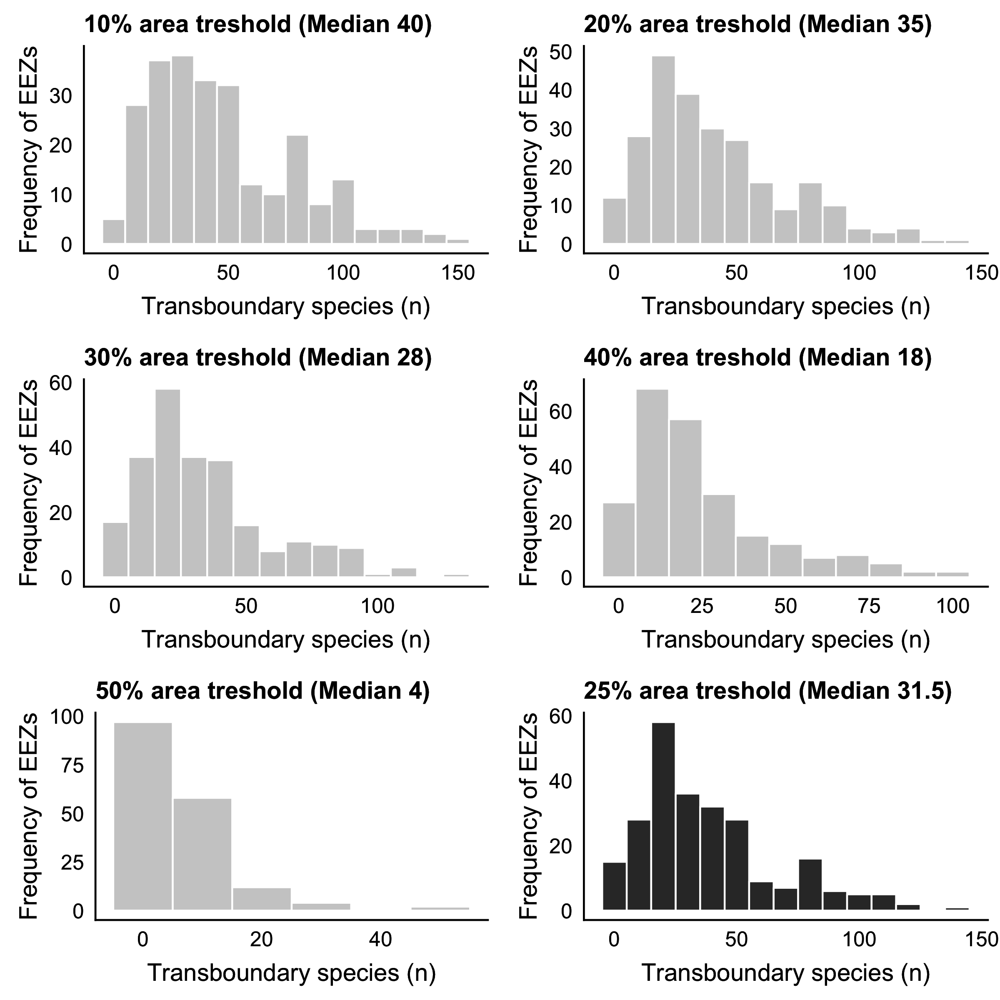

```{r Ch2_setup, eval = T, echo=F, warning=F,message=F, results='hide'}

#### READ ME !!! ####
# Run this chunk before knit so you make sure you have all pkgs installed in R

ipak <- function(pkg){
  new.pkg <- pkg[!(pkg %in% installed.packages()[, "Package"])]
  if (length(new.pkg)) 
    install.packages(new.pkg, dependencies = TRUE,repos = "http://cran.us.r-project.org")
  sapply(pkg, require, character.only = TRUE)
}


#### Library ####
packages <- c(
  "dplyr", # Data manipulation
  "knitr",
  "kableExtra",
  "png",
  "grid",
  "here"
  
)

ipak(packages)

```

<!-- # Instructions for submission -->

<!-- - Journal: *Science* -->
<!-- - Information to authors (https://www.sciencemag.org/authors/science-information-authors) -->
<!-- - There are two types of article: -->

<!-- -- **Reports** (up to ~2500 words including references, notes and captions–corresponds to ~3 printed pages in the journal) present important new research results of broad significance. Reports should include an abstract, an introductory paragraph, up to four figures or tables, and about 30 references. -->

<!-- Materials and Methods should be included in supplementary material -->

<!-- --- Instructions for preparing an initial manuscript https://www.sciencemag.org/authors/instructions-preparing-initial-manuscript -->

<!-- # Reviewers (5): -->
<!-- *Include Names, affiliations, and e-mail addresses of up to five potential reviewers and up to five excluded reviewers.*   -->

<!-- **Note:** Please include potential reviewers you think appropiate to review the manuscript (Or confirm my suggestions) -->

<!-- - **Potential Reviewers (J)**   -->
<!--  -- Gakushi Ishimura, Faculty of Agriculture Department of Food Production and Environmental Management, Iwate University, Morioka, Japan; gakugaku@iwate-u.ac.jp -->
<!--  -- Rebecca Selden, Wellesley College, Wellesley, MA, USA; bselden@wellesley.edu -->
<!--  -- Julia Xue, Shanghai Jiao Tong University; juliaxue@ouc.edu.cn -->
<!--  -- Claire Armstrong, The Norwegian College of Fishery Science, Tromso, Norway claire.armstrong@uit.no -->


<!-- - **Excluded Reviewers (J)**   -->


# One Sentence Summary (125/~125 characters)
<!-- *A brief teaser statement highlighting main result of the paper, understandable by a scientist not in your field, without jargon or abbreviations. This will appear online adjacent to the title and should not repeat phrases already present there* -->

Marine species shared by neighboring nations contribute to over 50% of catches and fishing revenue with direct implications for fisheries management.

<!-- # Field code (Max. 2) -->

<!-- - *Fisheries* -->

# Abstract (150/~125 words)
<!-- *An opening sentence that sets the question that you address and is comprehensible to the general reader, background content specific to this study, results, and a concluding sentence. It should be a single paragraph.* -->

Regulatory boundaries and species distributions are often not aligned, especially in the case of marine species crossing multiple Economic Exclusive Zones (EEZs). This represents a challenge for fisheries management as policies tend to focus at the national level, yet collaborations are needed to maximize long-term ecological, social and economic benefits. Here, we combined species distributions and the spatial delimitation of EEZs to identify the number of commercially exploited marine species that are shared between neighbouring nations. We found that 67% of the world's identified fished species are transboundary (n = 633) and were responsible for 80% of the global-EEZs catches (47 million tonnes) and 78.5% of fisheries revenue (USD 65 billion) in last decade. Some countries received over 70% of their economic benefits from a few shared resources. This study highlights the large and under-recognized challenge in achieving international fisheries management goals, particularly as species redistribute under climate change.

# Main Article (3200/~2500 words)
<!-- # Introduction (~555/500 words) -->

Distributions of marine species around the world are not constrained by human-made boundaries; rather they are shaped by biotic and abiotic factors defined by their evolutionary history [@Hutchinson:1957nt; @Nelson:2016kk]. Thus, a species can have a broader distribution (cosmopolitan) or be endemic [@Nelson:2016kk]. However, fisheries management is predicated on the definition of “stocks” that, in most cases, are delineated by human-made spatial boundaries that often do not correspond to biologically-meaningful population units [@Song:2017iua; @FredstonHermann:2018kp]. The delineation of Economic Exclusive Zones (EEZs) under the United Nations Convention on the Law of the Seas (UNCLOS) in the early 80s, for instance, established political boundaries across the distribution of many species, creating shared species between nations. Theories and empirical experience have show that fisheries targeting resources that straddle between political boundaries complicate fisheries management and potentially reduce its effectiveness to achieve stated objectives [@Munro:2002uf; @Bailey:2010ga]. For instance, climate-driven changes in species distributions have led to conflict between nations due to changes in the proportion of captures [@Munro:2002uf], quota allocation, and fishery newcomers [@Spijkers:2017ij]. Moreover, climate change is likely to exacerbate these types of conflict and presents new challenges for political relations between neighboring countries [@Pinsky:2018cb] and for fisheries management [@Miller:2013iv].

Forty years after the formal adoption of UNCLOS, accurate estimates of the number of exploited marine species that are shared by neighboring nations (hereafter called transboundary species [@Munro:2002uf]) is still unclear. Early data limitations on species' distributions allowed only for an informed guess on the number of transboundary species [@Caddy:1997ue] while a more recent study explored the historical contribution of shared stocks following a litterature review [@Teh:2015gd]. Thus, no method has included the actual distribution of species in the quantification of transboundary stocks. Here, we aimed to estimate the number of exploited marine species shared by neighbouring countries and determine their contribution to global and regional catch and fisheries revenue. Moreover, we categorize species according to their exploitation rate while identifying differences by habitat preference. We hipothesize that the methodological constraints of preious work has resulted in an underestimation of the contribution of these species to global catch and revenue, and that the proportoin of transboundary species is larger than previouslly estimated.

We overlaid the known distribution of 938 commercially valuable marine species responsable for an average of 96.5% of global EEZ catch reconstruced by the *Sea Around Us* at the species level between 2005 and 2014, and the EEZ of 153 coastal countries. We define a ‘stock’ unit as a species in an EEZ, instead of using a population ecology definition (genetically or morphological distinct units) due to lack of such biological information for almost all the species included in this study [@Teh:2015gd]. While we acknowledge that a species could have multiple stocks within an EEZ, many fisheries within a country or EEZ are managed at the species instead of stock level. Also, recent research has suggested strong connectivity between stocks, even when separated by thousands of kilometers [@Ramesh:2019va] providing additional ecological ground for our analysis. For this analysis we only considered shared species between neighboring EEZs, rather than the species' extended distribution (e.g. we did not include the high seas). We relay in multiple data sources including occurance, distribution models and catch data and only considered a species to be present in a grid cell if all data sources predicted positive occurrence (see Methods). Finally, each neighbouring EEZ had to have more than 25% of a species' distribution in order for the species to be categorized as transboundary.
<!-- ## Results and discussion (~1000 words) -->

We identified 633 transboundary exploited species in the world, more than double of previous estimates [@Teh:2015gd], representing 67.5% of the species analyzed. Between 2005 and 2014, national fleets targeting transboundary species within EEZs landed an average of 47.6 million tonnes, representing 79.9% of the EEZ-derrived catches reconstructed by the *Sea Around us* at the species level, and generating USD 65,483 million in fishing revenue. This is equivalent to 78.5% of the global fishing revenue of the same period. These values are more than the 34.2 million t and USD 30,700 million in fishing revenue previously estimated [@Teh:2015gd]. Based on our assesment (see Methods), 590 transboundary species were also identified as discrete species. This is the case of species such as Peruvian anchoveta (*Engraulis ringens*) that is fished by Peru, Chile, and Ecuador but only transboundary between Peru and Chile. The contribution of discrete species (e.g. the anchoveta catch of Ecuador) was 14.8 million tonnes representing USD 22,167 million in fishing revenue. Within these species, 305 species were considered exclusiveley discrete species, that is, they could be fished by neighbouring nations but were not considered transboundary. These species represented only 2.7 million tonnes and 3,691 million USD between 2005 and 2014. These results underscore the importance of transboundary species at the global level (Fig. 1).


```{r Call_Map, eval = F, fig.width=6, fig.height=4, echo=FALSE, fig.pos= "H", fig.cap="Number of transboundary marine species and their contribution to global fisheries catches and revenue. A) The number of species and amount of revenue are represented by colour coding of EEZs and land polygons, respectively. B) Contribution of tranbsoundary species to regional revenue (left) and catch (right). Regions according to the United Nations sub-regions. Points = mean +- sd. Revenue in 2010 real USD"}

img <- readPNG(here("./Figures/Fig1.png"))
grid.raster(img)

```


We aggregate countries according to the United Nations sub-regions and found that transboundary species are particularly economically important for Northern America (3,901 $\pm$ 4,497 million USD) and Eastern Asia (2,827 $\pm$ 2,667 million USD), significantly differing from other regions in terms of revenue (one-way ANOVA; *DF*(16,157) = 4.91, *p* < 0.001, $\alpha$ = 0.05) (Fig 1B). China (USD 6,279 million) in E. Asia and the US (USD 9,605 million) in N. America contribute 55% and 83% to their respective region's revenue, respectively. Russia (USD 6,361 million), Peru (USD 5,211) and Japan (USD 3,369) complete the top five countries with the most fishing revenue generated from transboundary species in the last decade. These five nations are responsible for 30% of the fishing global revenue from transboundary species. Peru and Russia, responsible for the two largest fisheries in the world [@FAO:2018KK], lead transboundary catch statistics harvesting over 5,000 thousand tones each on average between 2005 and 2014 (Fig S1). Peru's catches are mainly composed of Peruvian anchoveta (*Engraulis ringens*), shared with Chile, and accounting for 79% of the transboundary species production. Similarly, Russia shares the Alaskan polllock (*Theragra chalcogramma*) fishery with both Japan and the US. Despite the large catch volume of Peru and Russia, regional catches are only significantly different in E. Asia (one-way ANOVA; *Df*(16,155) = 3.341, *p* < 0.001, $\alpha$ = 0.05), with China, the world's top fish producer with 15.3 million tons harvested in 2016 [@FAO:2018KK] getting around 1/3 of its capture from transboundary species, followed by Japan (4.2 million tonnes) and South Korea (2.3 million tonnes). Differences in tansboundary fisheries can also be ilustrated in terms of catch-revenue/EEZ $km^2$ (Figure S2). As an example, the aggregated area of all EEZs of Northern Europe is 3.3 million $Km^2$, the $5^{th}$ smallest of the 17 groups analized (Table S1), however, it has the most revenue (USD 246.7 million per $Km^2$) and catch (260.1 tonnes per $Km^2$) of transboundary species per EEZ area, but only significantly differing from Sub-Saharan African and Southern Europe countries (*p* < 0.05).

We determined the exploitation category of each species according to the catch trend within each EEZ (Fig. 2) [@Kleisner:2011wn]. Previous studies demonstrated that catch trends can be used to infer whether a stock is healthy, over-exploited or collapsed [@Kleisner:2011wn]. Following this concept, Category A would represent fisheries that are re-building or under-exploited, category B would be species that are sustainably harvested, and Category C would be species that are over-exploited. We found significant differences in exploitation categories based on whether or not a species was transboundary (MANOVA, *Df*(2,446) = 53.9, *p* < 0.001). In the case of discrete species, only Category C is significantly different than the rest (one-way ANOVA, *Df*(2,446) = 52.88, *p* < 0.001; $\alpha$ = 0.05; Tukey's post hoc test *p* < 0.001). On the other hand, for transboundary species, all categories are significantly different (one-way ANOVA, *Df*(2,446) = 52.88, *p* < 0.001, $\alpha$ = 0.05; Tukey's post hoc test *p* < 0.05 for all categories). While many environmental and social-economic factors (e.g. temperature, markets, fishing policies) affect fishing effort and catch volume [@Pauly:2013gs; @Branch:2008kk], this result suggests that the management of discrete species could be better off as the variation between categories A and B are closer (*p* = 0.052) than for transboundary species (*p* = 0.002). 

```{r Call_Circ_Country, eval = F, fig.width=6, fig.height=4, echo=FALSE, fig.pos= "H", fig.cap="Number of transboundary species by catch category. Category A, fishing between 10%-50% of maximum catch level after a drop larger than 10% of the recorded maximum catch; Category B, fishing over 50% of maximum catch level; Category C, fishing less than 50% of maximum catch"}

img <- readPNG(here("./Figures/Fig2.png"))
grid.raster(img)
```


Empirical analysis suggests that in most cases, management of transboundary species will have better outcomes in terms of fish yields when nations cooperate [@Bailey:2010ga]. Examples of successful co-management include Canada and the United States over Pacific salmon [@Song:2017va], Norway and Russia over Atlantic cod (*Gadus morhua*), haddock (*Melanogrammus aeglefinus*) and capelin (*Mallotus villosus*) in the Barents Sea [@Diekert:2010gp; @Eide:2013dha], and Namibia and South Africa over hake (*Merluccius spp*) [@Sumaila:2003vw]. Lack of collaboration over shared stocks may threaten stock sustainability [@Clark:1980js; @Nguyen:2018dk], and reduce the future profitability potential of the fishery [@Merino:2007jz]. Yet, we acknowledge that cooperation or lack thereof can be a complex process [@Jensen:2015cf] and that there are specific cases where cooperation might not be the best strategy [@Munro:2015df]. Collaboration can also reduce conflict between nations over shared resources as climate change shifts the distribution of species creating tension between countries. Transboundary fisheries are abundant and of economic importance for some of the top countries with past fisheries-related conflicts including Canada, the US, China and Russia [@Spijkers:2019cz]. For example, the United States and Canada had a dispute over Pacific salmons (*Oncorhynchus sp*) that lasted over 10 years and was only resolved after these two nations set a series of regulations were introduced to compensate for losses [@Munro:2002uf]. Since 2007, the European Union, Norway, Iceland, and the Faroe Islands have been at odds over the size and relative allocation of total allowable catches (TACs) for Atlantic mackerel (*Scomber scombrus*) [@Spijkers:2017ij], a species that is transboundary and contributed an average of 598.4 thousand tonnes to catches (8.19% of total) and USD 850.2 million in revenue (7.17% of total) to the countries involved in the dispute between 2005 and 2014. The relatively small contribution of mackrell to the involved countries suggests that even a small fraction of the year's catch can lead to important conflicts between neighboring countries. In addition to past and present conflicts, climate change is likely to exacerbate conflicts over transboundary species due to shifts in their distribution, requiring flexible agreements that accommodate future uncertainties [@Pinsky:2018cb].

<!-- **NOTE: DOUBLE CHECK REFERENCES eddie and derek]** -->

Over 130 marine fish species occur in tropical and subtropical waters around the world [@Nelson:2016kk], from highly migratory species associated to pelagic-oceanic ecosystems like tunas (*Thunnus sp.*), to less mobile reef-associated species lke greater amberjack (*Seriola dumerili*), to species found in demersal ecosystems like gilthead seabream (*Sparus aurata*). Species associated to pelagic-oceanic ecosystems are the only group whose EEZ range (i.e., the number of EEZs where the species occur as transboundary) was significantly different from other groups (one-way ANOVA; *DF*(5,109) = 14.67, *p* < 0.001, $\alpha$ = 0.05; Tukey's post hoc test *p* < 0.05) with a median of 40 EEZs per species. The median for species of all other ecosystem preferences is close to, or less than, 20, as many of these species have a narrower distribution or are less mobile (Fig. 3).


```{r Call_Spp_Circular, eval = F, fig.width=6, fig.height=4, echo=FALSE, fig.pos= "H", fig.cap="Number of countries shared by transboundary species. Showing only species that share > 20 countries"}

img <- readPNG(here("./Figures/Fig3.png"))
grid.raster(img)
```


Due to their large migration patterns and presence in areas beyond national jurisdiction, many highly migratory pelagic fish species are managed by Regional Fisheries Management Organizations (RFMOs). Fifteen major RFMOs in the world oversee the management of 99 species [@CullisSuzuki:2010fi]. We estimated that 81.8% of these species are shared across neighboring RFMOs, with the International Commission for the Conservation of Atlantic Tunas (ICCAT) sharing over 40 species with neighboring RFMOs (Fig. 3). The effectiveness of RFMOs responsible for managing high migratory stocks has been previously questioned [@CullisSuzuki:2010fi; @Lodge:2007bt]. However, despite a global expansion of the industrial fleet in the last decade [@Coulter:2020gr], a recent analysis of 13 species (40 stocks) suggests that most tuna and billfish stocks are sustainably harvested with only three stocks currently considered as overfished [@Pons:2016ep]. In the other hand, species with narrower ranges are often managed at the national level due to localized populations, however, the potential boundary-crossing of these species must not be ignored [@Payne:2008vm]. The world of fisheries is highly connected through larvae dispersal [@Ramesh:2019va] and so, even centralized populations could be supplying populations thousands of kilometers away [@Ramesh:2019va]. In addition, coral regions often share multiple species, making coordination among countries key to achieve fisheries and conservation goals [@Levin:2018in; @Payne:2008vm]. Many coastal communities, particularly in developing regions, are highly dependent on subsistance fishing for food security and livelihoods [@CisnerosMontemayor:2016gq; Wabnitz:2018gf]. For example, all of the top five countries fishing transboundary reef and pelagic-oceanic associated species (Fig. 3B) are among the highest fish consuption countries (> 10 g of fish protein per capita per day) [@FAO:2018KK]. In these countries, both pelagic and reeef fishes contribute substantially to both local food security and livelehood [@Cabral:2018hc]. In the case of Kiribati, the Solomon Islands and Papua New Guinea, they are parties to the Pacific Nauru Agreement that sustainably manage 30% of global skipjack tuna [@Aqorau:2018bh], estimated to produce $2 billion worth of fish every year, representing a role model for transboundary fisheries management [@Hanich:2010ht].

In our analyses we did not seek to include climate change as a driver of species’ distribution. Distribution shifts are the most commonly recorded response of marine species to the effects of climate change - chiefly warming - in the ocean [@Poloczanska:2016kk]. Catch composition might have already changed in the last five decades [@Cheung:2013gk] and will continue throuugh the $21^{st}$ century [@Cheung:2016jd]. Previous study projected that climate change will bring at least one new transboundary species per EEZ in the future [@Pinsky:2018cb], while also change the proportion of the distribution (e.g. Area Index) that each county’s share to a degree that could influence fisheries management (*Palacios-Abrantes et.al. under review*). Exploring the detailed impacts of climate change in share species is key to develop local adaptation methods to minimize the effect of such distributional change on the conservation of species as well as the economy and food security of coastal nations.

Our study identified species currently shared by neighboring coastal nations and highlights the importance of these species' contribution to global capture and revenue from wild fisheries. Our results show that captures and revenues from shared species are substantially higher than those from discrete species, as well as than previously estimated. This result highlights the importance of transboundary fisheries and their potential contribution to food security and wellbeing. Moreover, we show significant differences in the management of transboundary and discrete species, suggesting a need for improving the management of transboundary fisheries. Previous work has found that collaboration will result in better outcomes for shared marine resources [@Bailey:2010ga]. Thus, countries should pay specific attention in the management of the identified transboundary stocks potentially creating collaborative management plans. Identifying existing transboundary species is the first step towards joint management frameworks that are precautionary, strive for sustainability, and can be flexible to accommodate the uncertain future driven by climate change.


<!-- # **Acknowledgments* * -->

<!-- ## Funding: include complete funding information;  -->
<!-- ## Authors contributions: a complete list of contributions to the paper (we encourage you to follow the CRediT model), -->
<!-- ## Competing interests: competing interests of any of the authors must be listed (all authors must also fill out the Conflict of Interest form). Where authors have no competing interests, this should also be declared. -->

## Data and materials availability

All data is available from the authors upon request.

# Materials and Methods

To ascertain whether or not a species can be considered transboundary, we developed a method based on a series of criteria and the overlay of species' distributions and the spatial boundaries of the world’s EEZs. All analyses were conducted at the species level and we consider transboundary species as those that occur within the Exclusive Economic Zone (EEZ) of neighboring countries [@Munro:2002uf]. All data was scaled to $0.5^o$ x $0.5^o$ lat-long grid cells.

## Databases of species' geographic distribution

To determine the number of transboundary marine species exploited by fisheries within each of the world's EEZs we used the reconstructed list of commercial marine fish and invertebrate species from the *Sea Around Us* (SAU) database (http://www.seaaroundus.org) and determined their current distributions based on an average from 1970-2000. The total number of species analized was 938 representing 54% of the average catch reported by the *Sea Around Us* between 2005 and 2014, including generalized categories such as *Marine fish not identified* or *Mollusca*. However, because we carried the analysis at the species level, we did not include such generalized categories in our comparrisons. Our final sample represents 63.2% of identified species, accounting for 96.52% of the catch identified at the species' level. To determine the current distribution of exploitable marine species, we used four data sources of species-distributions: (*i*) occurrence data, (*ii*) an Ensemble Environmental Niche Model (ENMs), (*iii*) a life-history-based distribution model, and (*iv*) fisheries catch data (Table 1). Each source represents a different method of estimating the distribution of a given species and thus, provides a more robust result. Only commercial fished species with data from all four sources were included in the analysis.

```{r Data_Table, eval = T, echo = F}

Source <- c(
  "Occurrence data",
  "Ecological niche model",
  "Species distribution model",
  "Catch data"
)

Abreviation <- c(
  "Occurrence",
  "ENM-Nereus",
  "SDM-SAU",
  "Catch-SAU"
)
Main_Method <- c(
  "Occurrence data from multiple sources",
  "Environmental niche model based on environmental variables and different model algorithms",
  "Species distribution model based on species traits",
  "Spatial catch allocation based on country-by-country reconstructions"
)

Sources <-  c(
  "Reygondeau, 2019",
  "Asch et al., 2017 & Reygondeau, 2019",
  "Palomares et al., 2016",
  "Zeller et al., 2016"
)

data.frame(Source,
           Abreviation,
           Main_Method,
           Sources) %>% 
  rename("Main Method"=Main_Method) %>% 
  kable("latex", booktabs = T,
        caption = "Summary of data sources to estimate species' distributions. All data has a ressolution of 0.5 degrees latitude x 0.5 degrees longitude. All data is publically available, see references for details.") %>%
  kable_styling(full_width = F) %>%
  column_spec(2,width = "8cm") %>% #wraps text in column2
  column_spec(3,width = "3cm") #%>% #wraps text in column2

```


<!-- **NOTE: WC "Need to discuss how this affect the samples of transboundary species."**. -->
<!-- **NOTE: for transboundary lobsters https://books.google.com.ar/books?id=XEElAwNrKZsC&pg=PA224&lpg=PA224&dq=belize+mexico+lobster+shared+stock&source=bl&ots=lsmUH743d_&sig=ACfU3U1P1t7_L8q_YRh3oQGszUO8Lg1jFw&hl=en&sa=X&ved=2ahUKEwiv36qbwbjnAhX3HrkGHYIbCTgQ6AEwFHoECA0QAQ#v=onepage&q=belize%20mexico%20lobster%20shared%20stock&f=false** -->

### *Occurrence data*

Occurrence data was collected from five publicly available repositories: FishBase (http://fishbase.org), the Global Biodiversity Information Facility (GBIF; https://www.gbif.org/), the Ocean Biogeographic Information System (OBIS; https://obis.org/),  the Intergovernmental Oceanographic Commission (IOC; http://ioc-unesco.org), and the International Union for Conservation of Nature (IUCN; https://www.iucn.org/technical-documents/spatial-data) [@Reygondeau:2019uh].

### *Distribution models*

In addition to occurrence data, we used two different methods to estimate species distributions, hereafter referred to as Ecological Niche Model-Nereus (ENM-Nereus) and Species Distribution Model-SAU (SDM-SAU). Although they use the same occurrence and environmental data, the models are structurally different complementing each other and providing robustness to the results.

The ENM-Nereus consists in a multimodel approach based on a Bioclim and a Boosted Regression Tree model [@Thuiller:2009gp], a Maxent model [@Phillips:2006ff], and a Non-Parametric Probabilistic Ecological Niche Model [@Beaugrand:2011fd]. Environmental variables utilized in the models include sea surface temperature, surface pH, surface oxygen concentration, and vertically integrated (0–100 m) net primary production (NPP) [@Asch:2018ca]. The ENM-Nereus employed all of the observational data-sources previously mentioned. Global environmental conditions were average for the period 1970-2000 and averaged for three Earth System Models developed by the Geophysical Fluid Dynamics Laboratory (GFDL- https://www.gfdl.noaa.gov/earth-system-model/), the Institute Pierre Simon Laplace (IPSL- www.icmc.ipsl.fr/), and the Max Planck Institute for Meteorology (MPI- www.mpimet.mpg.de/en/science/models/). See [@Asch:2018ca; @Reygondeau:2019uh] for model details.

The SDM-SAU model follows a five-steps process based on species-specific life history data, rather than environmental variables [@Close:2006ux; @Pauly:2016uz]. For each commercial marine species, the model first uses the FAO major fishing areas and countries' EEZs to determine a broad distribution. It then uses life history information to delimit its range within the FAO fishing area (e.g., thermal preference, depth limit). The range is delimited even further by expert-review polygons and compared with that of AquaMaps [@Kaschner:2016tl], OBIS and GBIF occurrence data. The model then determines a species habitat preference based on the assumption that the relative abundance of a species is determined by the number of habitats in a grid cell and the distance of the species to each habitat, as well as the importance of the habitat to the species size. Finally, the species equatorial submergence (e.g. the latitudinal region where a species is not seen in between poles) is estimated for each species. See [@Close:2006ux; @Pauly:2016uz] for model details.

### *Catch data*

The previous models combine observational data with a series of biotic and abiotic data to determine the probability that a species will be found in a given space at a given time. However, this does not mean that the species in question will actually be there. While the models do use approaches to double-check species occurrences (e.g., ENM-Nereus uses four different species distribution algorithms and SPD-SAU undertakes validation by means of other models), we used a fourth data source to corroborate the models’ outputs. The Sea Around Us estimates total reconstructed catches - catches based on all publicly available information sources and including discards, as well as unreported and illegal catches that are not included in available FAO data - for each country. Catches are also spatially allocated [@Zeller2016]. Thus, we used the Sea Around Us catch reconstruction database from 2005 to 2014 as the fourth dataset to estimate transboundary species and to estimate their catch contribution within EEZs. We selected this time frame to investigate the recent (our time frame includes the last ten years of data) contribution of transboundary fisheries to cathces and revenue from fisheries and to reduce the uncertanty embeded in the reconstruction process (See key uncertanties, below).

## Determining transboundary species trait

We developed a four-criteria methodology to determine whether or not a species can be considered transboundary. Only species that meet all criteria were considered as transboundary and the analysis was undertaken only within the EEZs of coastal states. In some cases, criteria can also be interpreted as indices to measure the uncertainty in the analysis as they provide a continuous index (e.g. from 0 to 1) rather than a discrete, yes or no, index. All analyses were run using the statistical software *R version 3.5.2 (2018-12-20)* with the packages *data.table* [@Packagedatatable:2019uh], *janitor* [@PackagejanitorSim:2018ur], *wesanderson* [@Packagewesanderson:2018vn], *rfishbase* [@PackagerfishbaseR:2019th], *R.matlab* [@PackageRmatlabRe:2018un], *sf* [@PackagesfSimpleF:2018vp], *sp* [@PackagespClasses:2019tn], *tidiverse* [@PackagetidyverseE:2017vq], *tidytext* [@PackagetidytextTe:2019vk], and *zoo* [@PackagezooSInfr:2019tm]. All code is available at https://github.com/jepa/FishForVisa.

### Criteria 1; Neighboring EEZs

As previously mentioned, we define transboundary species as those marine species that occur within the EEZs of two or more neighboring countries. Hence, according to this criteria a species was only considered as transboundary if it was shared between two neighboring countries, regardless of the species extended distribution. We defined EEZ boundaries using the Sea Around Us shapefile (updated 1 July 2015, available from http://www.seaaroundus.org), noting that it subdivides EEZs by regions (e.g., Mexico Pacific and Mexico Atlantic), and determined the intersections between polygons using the R package sf. When estimating transboundary species, we filtered out those shared by EEZs sub-regions, and when aggregating results by country, species that occurred in more than one sub-region were only accounted for once. Species that were present in EEZs that were non-continental territories neighboring other countries were kept separately (e.g., Argentina and Falkland Islands), but removed in cases where the non-continental territory belonged to the same nation (e.g., Brazil and Fernando de Noronha). Associated states like Puerto Rico and Hong Kong were added to their Sovereign (e.g. Puerto Rico with the United States and Hong Kong with China). 

### Criteria 2; Data agreement

We used the occurrence database, the ENM-Nereus model, and SDM-SAU model to determine the presence of each species within each of the $0.5^{\circ}$ x $0.5^{\circ}$ grid cells. We computed a *Species Index* by dividing the number of datasets that confirmed the presence of a species in a grid cell over the total number of datasets (n = 3). The index is unit-less and represents a scale from 0.3 to 1, with 0.3 indicating that only one dataset reported the presence of the species in a grid cell, 0.6 two out of three sources, and 1 pointing to agreement across all 3 datasets. All analyses only considered cases where *Species Index* = 1 to obtain a more conservative estimate of transboundary species.

### Criteria 3; Modeling verification

We assumed that a species was only present in a given grid-cell if it was reported in the Sea Around Us catch database. Therefore, all species that were not reported as caught in any single year between the reference years (2005 to 2014) in a given grid-cell were dropped, regardless of the *Species Index*. This rule assumes that if a commercial species is projected within any fishing country, such a species would have been fished, and thus reported at some point over a period of time (here 2005 - 2014), thus validating the models. See [@Pauly:2019bf] and [@Zeller2016] for catch reconstruction and spatial allocation details.

### Criteria 4; Spatial distribution

Finally, to have a more robust result and not categorize a species as transboundary based on its presence in a single $0.5^{\circ}$ x $0.5^{\circ}$ grid cell within an EEZ, we computed an *Area Index*. The *Area Index* consist in the proportion of a given species' overarching shared distribution between neighbouring EEZs accounted for by each individual EEZ. We classified a species as transboundary if both neighboring EEZs enclosed over 25% of the species joint shared distribution. This threshold can be lowered for a more relaxed result or increased for a more conservative estimate (Fig. S3).

## Fisheries trends

We estimated the economic contribution in 2010 real USD of transboundary species for each country using global ex-vessel price data [@Tai2017]. The database we draw from includes ex-vessel price from multiple sources and a structured interpolation method (e.g. similar countries, species) to fill in data gaps [@Sumaila:2015uc]. The contribution of transboundary species was derived by aggregating the catch of species occurring within the EEZs of countries sharing that species. For this study, we did not include catch nor revenue from areas beyond national jurisdiction. Finally, we used the catch data to determine the exploitation category of each species within an EEZ. Although this method has previously been used to estimate stock status [@Grainger:1996tk], the categories presented here are intended as catch trends, and not status for each species. We only assessed species within each EEZ for which at least ten years of data were available between the first and last reported catch and with at least five consecutive years of data. Three final categories were drawn for each species depending on the catch volume within each EEZ (e.g. present, maximum and minimum EEZ's historical catch) and the year (e.g. year of maximum historical catch of the species within that EEZ) (Table 2) [@Kleisner:2011wn]. Finally, we reported the predominant category over the last ten years of catch data (2005-2014). We performed a series of one-way analysis of variance (one-way ANOVA) to determine statistically significant differences between the means of different groups (e.g., geographical regions, species, exploitation categories) of transboundary species and their contribution to catch and fishing revenue [@Chambers:1992up].

```{r Status_Table, eval = T, echo = F}

### Original version

# Stock_Status <- c("Rebuilding","Developing","Max Exploited","Over Exploited","Collapsed","No Status")

# Rules <- c(
#   "(Year of Catch > Year Post Max. Min. & Post Max Min Catch < (Max Catch*0.10)) & (Catch > (Max Catch*0.10) & Catch < (Max Catch*0.50))", # Reb.
#   "Year of Catch < Year of Max. Catch & Catch <= (Max Catch*0.50) or Year of Max Catch = Last Year of data)", #Dev.
#   "Catch > (Max Catch*0.50)", #Max Exp.
#   "Year of Catch > Year of Max. Catch & (Catch > (Max. Catch*0.10) & Catch < (Max. Catch*0.50)", # Over.
#   "Year or Catch > Year of Max. Catch & Catch < Max. Catch*0.10", # Colla.
#   "Non of the above rules applied"
# )


# data.frame(Stock_Status,
#            Rules) %>% 
#   kable("latex", booktabs = T,
#         caption = "Rules to determine the status of each transboundary species") %>%
#   kable_styling(full_width = F) %>%
#   column_spec(1,width = "3cm") %>% #wraps text in column2
#   column_spec(2,width = "13cm") #%>% #wraps text in column2

### Grouped version

Categories <- c("A - Growing Fishery",
                  "B - Stable Fishery",
                  "C - Fishery under 10% of Peak",
                  "No Status")

Rules <- c(
  "(Year of Catch > Year Post Max. Min. & Post Max Min Catch < (Max Catch*0.10)) & (Catch > (Max Catch*0.10) & Catch < (Max Catch*0.50)) or Year of Catch < Year of Max. Catch & Catch <= (Max Catch*0.50) or Year of Max Catch = Last Year of data)", #Rebuilding or #Developing
  "Catch > (Max Catch*0.50)", #Max Expploitation
  "Year of Catch > Year of Max. Catch & (Catch > (Max. Catch*0.10) & Catch < (Max. Catch*0.50) or Catch < Max. Catch*0.10", #Over explpoited or collapsed
  "Non of the above rules applied"
)


data.frame(Categories,
           Rules) %>% 
  kable("latex", booktabs = T,
        caption = "Rules to determine the category of each transboundary species") %>%
  kable_styling(full_width = F) %>%
  column_spec(1,width = "3cm") %>% #wraps text in column2
  column_spec(2,width = "13cm") #%>% #wraps text in column2

```

## Key uncertainties
<!-- # Related to Criteria 1 (Neighbours) -->
We have identified four key uncertainties in the method that may affect the estimation of transboundary stocks. Firstly, we ran the analysis at the species level due to limited spatial-specific data on species sub populations (stocks), therefore we are not able to identify transboundary stocks within EEZs. However, we defined transboundary only between  neighbouring countries (e.g. US and Canada) and did not include countries that were separated by another country (e.g. Canada and Mexico) and/or the high seas (e.g. Canada and Spain). Our results are likeley a conservative estimation of transboundary species as we did not cover all marine taxa in the world [@Reygondeau:2019uh] and only analyzed species present in all four data sources. Nevertheles, our results are representative of a substantial proportion of the world's marine captches and revenue from economically important marine fisheries.
<!-- Related to Criteria 2 (Models) -->
Secondly, the predicted species distribution is affected by the uncertainties of the environmental data and models used for such predictions. Structural differences within Earth System Models results in variations of oceanic conditions, which undoubtedly affect the ENM-Nereus. We averaged the results from the three models in an effort to capture the structural variation across models. Climate natural variability is a major driver of marine species distribution, potentially removing a species from an EEZ for long periods (e.g. Anchovies and Sardines "regimes" in the Eastern Pacific are strongly influenced by water temperature decal oscillations [@Chavez:2003jr]). Thus, a species’ distribution can potentially be reduced or shifted in such way that it only covers one EEZ until oceanic conditions change again and the associated species' distribution expands. To account for such climate variability, we derived the ENM-Nereus results as an average of oceanic conditions between 1970 and 2000. This is not an issue for the SDM-SAU as it does not directly require environmental variables [@Pauly:2016uz].
<!-- Related to Criteria 3 (SAU catch data) -->
Thirdly, we assumed that, if the Sea Around Us reconstructed data recorded a species as caught in any given grid cell, then the species was present within that grid cell. While catch data is not exempt of uncertainty, in most cases, the differences between the Sea Around Us and the FAO self-reported data is smaller towards recent years [@Pauly:2019bf]. Thus, we limited the catch data reference period in our analyses to between 2005 and 2014, the last ten years of data available. Likewise, the spatial allocation of the catch is subjected to imprecisions, mainly produced by differences in the spatial scale of the original data and the method employed by the Sea Around Us. However, this discrepancy is mainly applicable to data provided by RFMOs in the high seas, which were not included in this study (see http://www.seaaroundus.org/data/#/spatial-catch and @Zeller2016 for mode details in the spatial allocation of the SAU).
<!-- Related to Criteria 4; Spatial distribution -->
Finally, the results of this study only considered those species that had a *Species Index* of 1 (e.g. all datasets agree on presence) and at least 25% of *Area Index* (e.g. the species shared distribution was at least 25% in each EEZ). This presents a relative conservative estimate of the number of transboundary species in the world. However, using a different *Species Index* will give results based on less datasets while a smaller *Area Index* will estimate more transboundary species (Fig. S4).

# Supplements

```{r Call_Sup_1, eval = F, fig.width=6, fig.height=4, echo=FALSE, fig.pos= "H", fig.cap="Number of transboundary species per EEZ and they contribution to countries' EEZ catch. The number of species is represented in the EEZ while the catch (thousand tonnes) is represented in the land polygon."}

img <- readPNG(here("./Figures/S1_Catch_EEZ.png"))
grid.raster(img)
```


```{r Call_Sup_2, eval = F, fig.width=6, fig.height=4, echo=FALSE, fig.pos= "H", fig.cap=""}

img <- readPNG(here("./Figures/FigS2.png"))
grid.raster(img)
```


```{r Call_Sup_3, eval = F, fig.width=6, fig.height=4, echo=FALSE, fig.pos= "H", fig.cap="Number of shared species by RFMOs. Analysis included with 85 species managed by Fourteen RFMOs"}

img <- readPNG(here("./Figures/S2_RFMO.png"))
grid.raster(img)
```




The number of gridcells in which a species is present (*Area Index*) is expected to directly influence whether or not a species is considered transboundary. Therefore, we tested the sensitivity of our results to the *Area Index* by estimating the number of transboundary species along a gradient of values (Fig. S3). As expected, using a more relaxed value (e.g. the species is present within 10% or more of the EEZ) will result in a greater number of transboundary species (median of 40 EEZs shared per species), while a more restrictive value (e.g., 50%) results in a median estimate of 4. The current analysis utilised a 25% *Area Index* threshold (Fig. S3 - darker histogram).

```{r Call_Sup_4, eval = F, fig.width=6, fig.height=4, echo=FALSE, fig.pos= "H", fig.cap="Histogram of transboundary species using different values of Area Index. Darker histogram represents used value (25%) in the analysis"}

img <- readPNG(here("./Figures/S3_Area.png"))
grid.raster(img)
```


# References (37/about 30)

<!-- # Recicled text (Not to be included) -->

<!-- From 1973 to 1982, members of the United Nations held a series of meetings to discuss regulations regarding the high seas, a region of international common property, at that time, consisting of waters from 12 miles from shore [@McRaeandMunro1989]. The establishment of the UN Convention on the Law of the Sea (UNCLOS) allowed coastal states to claim jurisdiction over the exploration and exploitation of marine resources over 200 nautical miles off their coasts [@UN:1982]. While intended to improve fisheries management by granting property rights over shared resources, this arbitrary delimitation of management areas was not informed by bio-geography, essentially ignoring species distributions and creating what we know today as shared fish stocks [@Gulland, @Munro2002]. Fish stocks, are comonly refered in fisheries management as a particular population that is more or less isolated from other stocks of the same species and hence self-sustaining [@FAO:1999tk]. The Food and Agricultural Organization (FAO) recognizes three types of shared stocks: (*i*) transboundary stocks, shared by 2 or more neighboring coastal nations; (*ii*) straddling stocks, occurring in two or more adjacent national jurisdictions and the high seas; and (*iii*) highly migratory stocks, found in the EEZs of coastal nations that are not necessarily adjoining, and the high seas. The inception of shared stocks called for the establishment of new fisheries management methods. Managers and scientists adopted a game theory approach – or means to analyze strategic interactions among decision-makers – which demonstrates that collaboration is most likely to result in the best overall outcome for nations sharing a common resource [@Bailey:2010ga,@Eide:2013dh]. Lack of collaboration in shared stocks may threaten stock sustainability [@Clark:1980js; @Nguyen:2018dk], reduce the profitability potential of the fishery [@Merino:2007jz], and lead to conflict between coastal nations [@Spijkers:2017ij], although cooperation and non-cooperation can be more complex [@Jensen:2015cf]. Moreover, under climate change, species distributions will shift [@Cheung2016], resulting in new shared stocks [@Pinsky:2018cb] and highlighting the key role cooperative fisheries management can play in maintaining stocks and profitability [@Nguyen:2018dk] as well as hopefully reducing fisheries conflict [@Spijkers:2019cz]. -->

<!-- There is a gap in assessing the nature and number of transboundary species in the world based on their spatial distribution. Caddy [@Caddy:1997ue] in 1997 estimated that there could be up to 1,500 transboundary fish species in the world. However, such estimation lacked a proper assessment due to limited information on the distribution of species at the time [@Caddy:1997ue]. More recently, Teh et al. [@Teh:2015gd] estimated that 206 species can be considered shared, accounting for a total catch of 34.2 million t and a global landed value of USD 30.7 trillion. While this represents a good starting point, the analysis was based on a literature review of shared species and did not include a mechanistic way of determining the transboundary nature of the species [@Teh:2015gd]. Thus, despite recent research highlighting the interconnection of marine species [@Ramesh:2019va], the total number of transboundary species is yet to be identified at a global scale. Yet, such an understanding is critical to effectively managing fisheries, as needs differ substantially between discreet and shared species [@Mills] and climate change will yield new challenges associated with new shared fisheries [@Pinsky:2018cb]. -->

<!-- *Getting accurate estimates of the number of shared species and where they are located can help develop fisheries management and conservation plans that account for the challenges from transboundary resources management.*  -->

<!-- The Food and Agricultural Organization (FAO) recognizes three types of shared stocks: (i) transboundary stocks, shared by 2 or more neighboring coastal nations; (ii) straddling stocks, occurring in two or more adjacent national jurisdictions and the high seas; and (iii) highly migratory stocks, found in the EEZs of coastal nations that are not necessarily adjoining, and the high seas. We focus on estimating the number of species that meet the first category. -->

<!-- We used four-criteria that combined multiple species distribution data-sources and the world's EEZs to determine if a species can be considered a “shared species”. The first criteria consisted in only considering shared species between neighbouring EEZs, rather than the extended distribution. For the second criteria we considered a species to be present in a grid cell if all data sources predicted positive occurrence. Current species distributions were predicted from occurrence records obtained from publicly available observational databases of the world’s marine species and two structurally distinct species distribution models [@Asch:2018ca; Reygondeau:2019uh; @Zeller2016] (see Methods). The third criteria determined whether the species were exploited at the grid cell using spatially explicit catch data [@Zeller2016]. A species was kept if both catch data and predicted species occurrences were positive at the same spatial cells. Finally, the last criteria determined a spatial treshold to confirm that a species occurs in both neighboring EEZs. Once we have identified the shared stocks, we estimated the contribution of the species to fishing revenues and landings using the SAU database [@Zeller2016] and categorized them according to catch trends [@Kleisner:2013gh].  -->

<!-- Only Bluefin (*Thunnus thynnus*) in the Pacific, Bigeye (*Thunnus obesus*) in the west Pacific, and Yellowfin (*Thunnus albacares*) in the Atlantic still experiencing overfishing  -->