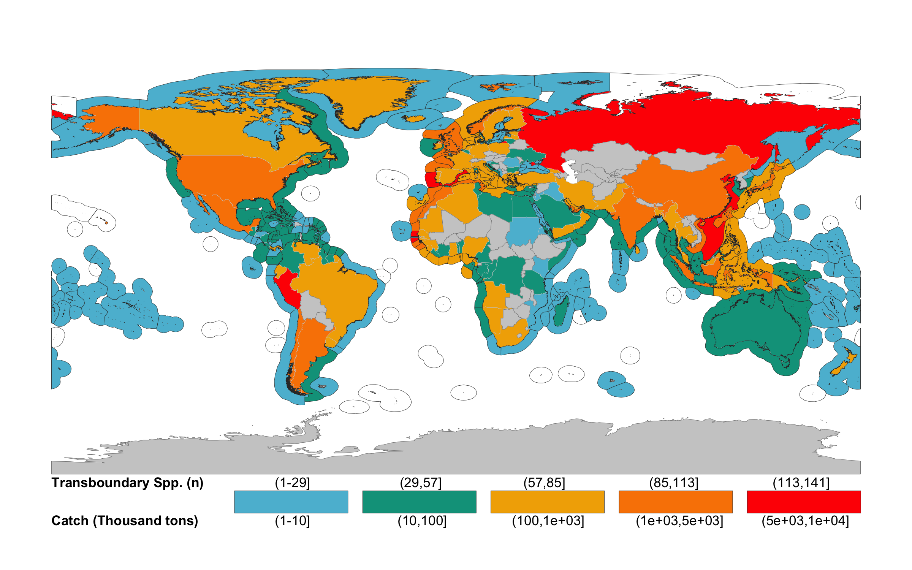

```{r Ch2_setup, eval = T, echo=F, warning=F,message=F, results='hide'}

#### READ ME !!! ####
# Run this chunk before knit so you make sure you have all pkgs installed in R

ipak <- function(pkg){
  new.pkg <- pkg[!(pkg %in% installed.packages()[, "Package"])]
  if (length(new.pkg)) 
    install.packages(new.pkg, dependencies = TRUE,repos = "http://cran.us.r-project.org")
  sapply(pkg, require, character.only = TRUE)
}


#### Library ####
packages <- c(
  "dplyr", # Data manipulation
  "knitr",
  "kableExtra",
  "png",
  "grid",
  "here"
  
)

ipak(packages)

```

# Instructions for submission

- Journal: *Science*
<!-- - Information to authors (https://www.sciencemag.org/authors/science-information-authors) -->
<!-- - There are two types of article: -->

-- **Reports** (up to ~2500 words including references, notes and captions–corresponds to ~3 printed pages in the journal) present important new research results of broad significance. Reports should include an abstract, an introductory paragraph, up to four figures or tables, and about 30 references.

<!-- Materials and Methods should be included in supplementary material -->

<!-- --- Instructions for preparing an initial manuscript https://www.sciencemag.org/authors/instructions-preparing-initial-manuscript -->

# Reviewers (5):
*Include Names, affiliations, and e-mail addresses of up to five potential reviewers and up to five excluded reviewers.*  

**Note:** Please include potential reviewers you think appropiate to review the manuscript (Or confirm my suggestions)

- **Potential Reviewers (J)**  
 -- Gakushi Ishimura,  
 -- Kathleen Miller, National Center for Atmospheric Research, Boulder, Colorado, USA  
 -- Malin Pinsky, Rutgers University, New Brunswick, New Jersey, USA  
 -- Steven D. Gaines, University of California, Santa Barbara, Santa Barbara, California, USA  

- **Excluded Reviewers (J)**  
-- U. Rashid Sumaila, Institute for the Oceans and Fisheries, University of British Columbia, Vancouver, Canada  
-- Louise S.L. Teh, Institute for the Oceans and Fisheries, University of British Columbia, Vancouver, Canada  

# One Sentence Summary (125/~125 characters)
*A brief teaser statement highlighting main result of the paper, understandable by a scientist not in your field, without jargon or abbreviations. This will appear online adjacent to the title and should not repeat phrases already present there*

Over 50% of marine fish landings and revenue comes from species shared by neighbouring nations having direct implications to fisheries management.

# Field code (Max. 2) 

- *Fisheries*

# Abstract (125/~125 words)
*An opening sentence that sets the question that you address and is comprehensible to the general reader, background content specific to this study, results, and a concluding sentence. It should be a single paragraph.*

Regulatory boundaries and species distributions are not always aligned, therefore marine species often cross multiple Economic Exclusive Zones (EEZs). This represents a challenge for fisheries management as the benefits from a shared resource is often maximized through collaboration. In here, we combined species distributions and the spatial delimitation of EEZs to identify the number of exploited marine fish species that are shared between neighbouring nations. We found that 64% of the world's capture and 50% or revenue comes from 633 shared species, with some countries receiving over 70% of their benefits from a few shared resources. Identifying shared species can play a critical role in the sustainability of wild fisheries suggesting a need for collaborative management strategies.


# Main Article
<!-- # Introduction (~555/500 words) -->

Distributions of marine species around the world are not bounded by human-made boundaries; rather shaped by contemporary biotic and abiotic factors, as well as their evolutionary history [@Hutchinson:1957nt; @Nelson:2016kk]. Thus, a species can be cosmopolitan and have a broader distribution like the spiny dogfish (*Squalus acanthias*), or endemic like the masu salmon (*Oncorhynchus masou*) who's distribution is limited to the Japanese coast [@Nelson:2016kk]. However, management of living marine resources is predicated on the definition of “stocks” that are delineated by human-made spatial boundaries that often do not correspond to biologically-meaningful population units [@Song:2017iua; @FredstonHermann:2018kp]. The delineation of Economic Exclusive Zones (EEZs) under the United Nations Convention on the Law of the Seas (UNCLOS) in the early 80s, for instance, established political boundaries across the distribution of many species, creating shared species between nations. Theories and empirical experience demonstrate fisheries targeting resources that straddle between political boundaries complicate fisheries management and potentially reduce its effectiveness to achieve stated objectives [@Bailey:2010ga]. For example, environmental fluctuation leading to changes in species distribution of a shared fishery have led to conflict because of changes in the proportion of captures between countries [@Munro:2002uf], or pressure in the quota allocation due to new participants wanting to join the fishery [@Spijkers:2017ij]. Moreover, climate change, which is shifting species distributions, is likely to exacerbate these types of conflict [@Pinsky:2018cb] and presents further challenges for fisheries management [@Miller:2013iv].

Forty years after the formal adoption of UNCLOS, accurate estimates of the number of exploited marine species that are shared by 2 or more neighboring coastal nations (hereafter called transboundary species [@Munro:2002uf]) in the world is still unclear. Caddy in 1997 estimated that there could be up to 1,500 transboundary fish species in the world. However, such estimation lacked a proper assessment due to limited information on the distribution of species at the time [@Caddy:1997ue]. More recently, Teh and Sumaila (2010) estimated that 206 species can be considered shared, accounting for a total catch of 34.2 million tones and a global landed value of USD 30.7 trillion. Such analysis was based on a literature review of shared species and did not include a mechanistic way of determining the transboundary nature of the species [@Teh:2015gd]. In here, we overlay the known distribution of **968** commercially valuable marine fish species and the EEZ of 153 coastal countries to identify those that are shared between neighboring EEZs and determine their contribution to the world's fisheries catch and revenue. 

We developed a four-criteria methodology to determine if a species was transboundary (see Methods). The first criteria consisted in only considering shared species between neighboring EEZs, rather than the specie's extended distribution. For the second criteria we considered a species to be present in a $0.5^o$ x $5^o$ grid cell if all data sources predicted positive occurrence. Current species distributions were predicted from occurrence records obtained from publicly available observational databases of the world’s marine species and two structurally distinct species distribution models [@Asch:2018ca; Reygondeau:2019uh; @Zeller2016]. The third criteria determined whether the species were exploited at the grid cell using spatially explicit catch data [@Zeller2016]. A species was kept in a grid cell if both predicted species occurrences and catch data were positive. Finally, the last criteria determined a spatial threshold to confirm that a species occurs in both neighboring EEZs. Once transboundary species were identified, we estimated their contribution to fishing landings and revenues using the *Sea Around Us* database [@Zeller2016] and categorized them according to catch trends [@Kleisner:2013gh]. We carry out the analysis at the species per EEZ level, rather than stocks (populations within a species), due to lack of stock-specific spatial and ecological information on all of the fished species [@Teh:2015gd]. Despite loosing detail-specific (e.g. a species could have multiple stocks within an EEZ),  many fisheries within a country or EEZ are managed at the species level, and recent research has suggested strong connectivity between stocks thousand of kilometers away [@Ramesh:2019va].

<!-- ## Results and discussion (~1000 words) -->

We identified **633** transboundary species in the world, more than double the number previously estimated [@Teh:2015gd], accounting for **65.4%** of the species analyzed (Fig. 1A). Between 2005 and 2014, national fleets targeting shared species within EEZs landed an average of **69.2** million tonnes, representing **64%** of the EEZ-global catch, and generating USD **79,745** million in fishing revenue. This is equivalent to **49.8%** of the global revenue of the same period. These values are higher than previously estimated reinforcing the importance of these species at the global level [@Teh:2015gd]. 


```{r Call_Map, eval = F, fig.width=6, fig.height=4, echo=FALSE, fig.pos= "H", fig.cap="Number of transboundary species and they contribution to fishing catch and revenue.** A) The number of species is represented in the EEZ while revenue from these species fished within the EEZ is represented in the land polygon. B) Regional revenue (left) and catch (right) contribution of tranbsoundary species. Points = mean +- sd."}

img <- readPNG(here("./Figures/Fig1.png"))
grid.raster(img)
```


Transboundary species are particularly important for Northern America (mean = 3,901 $\pm$ 4,497 million USD) and Eastern Asia (mean = 2,827 $\pm$ = 2,667 million USD), significantly differing from other regions in terms of revenue (one-way ANOVA; *F*(16,157) = 4.91, *p* < 0.001, $\alpha$ = 0.05) (Fig 1B). The large variation in revenue from these regions is driven by China (USD 6,279 million), in E. Asia and the US (USD 9,605 million) in N. America who contribute 55% and 83% to the region's revenue, respectively. Russia (USD 6,361 million), Peru (USD 5,211) and Japan (USD 3,369) complete the top five countries with more revenue from transboundary species. These five nations are responsible for 30% of the global revenue from transboundary species. Peru and Russia, responsible for the two largest fisheries in the world [@FAO:2018KK], lead the production of transboundary species harvesting over 5,000 thousand tones (**Supplemental figure Trans_Catch_MAP**). Peru's catches come mainly from Peruvian anchoveta (*Engraulis ringens*), shared with Chile, accounting for 79% of the transboundary species production. Similarly, Russia shares the Alaskan polllock (*Theragra chalcogramma*) fishery with both Japan and the US. Despite this, catches are only significantly different in E. Asia (one-way ANOVA; *F*(16,155) = 3.341, *p* < 0.001, $\alpha$ = 0.05), with China, the world's top fish producer with 15.3 million tons landed in 2016 [@FAO:2018KK] getting around 1/3 of its capture from transboundary species, followde by Japan (4.2 million tonnes) and South Korea (2.3 million tonnes).

Effective management of shared species is a challenging process as it often requires countries to agree on mutual targets in order to achieve sustainable harvest [@Munro:2002uf]. We found significant differences in the exploitation rate of transboundary species (one-way ANOVA *F*(5,446), *f* = 324.5, *p* < 0.001, $\alpha$ = 0.05; Tukey's post hoc test *p* < 0.05 for all) with most species fished at levels below 50%, sometimes lower than 10%, of their historical maximum peak (Fig.2). This is the case of coastal nations in all continents, but Oceania, with no significant difference between continents (one-way ANOVA *F*(5,443), *f* = 1.24, *p* = 0.289, $\alpha$ = 0.05), suggesting that the current global exploitation rate of transboundary species could be over the maximum sustainable yield [@Kleisner:2011wn; @Pauly:2013gs]. While these catch trends do not directly reflect stock status - e.g. other factors like markets, fishing policies or extreme events also influence catch volume [@Pauly:2013gs; @Branch:2008kk] - they could resemble fisheries that are over exploited or collapsed [@Kleisner:2011wn]. Countries that are today harvesting transboundary species at this rate (Category C) should revise their management policies to make sure these align with sustainable harvest of shared resources [@Munro:2004ug].

```{r Call_Circ_Country, eval = F, fig.width=6, fig.height=4, echo=FALSE, fig.pos= "H", fig.cap="Number of transboundary species by catch category, country, and continent. Category A, fishing between 10%-50% of max catch peak after a drop larger than 10% of max peak; Category B, fishing over 50% of max catch peak; Category C, fishing is between 10-50% of max catch peak or less than 10%"}

img <- readPNG(here("./Figures/Fig2.png"))
grid.raster(img)
```


Empirical analysis suggest that in most cases, management of transboundary species will have better outcomes in terms of fish yield when nations cooperate [@Bailey:2010ga]. Examples vary between regions and species including Mexico and the United States over Pacific anchovies [@CisnerosMontemayor:2020kv], Norway and Russia over Atlantic cod (*Gadus morhua*) [@Diekert:2010gp; @Eide:2013dha], and Namibia and South Africa over hake (*Merluccius spp*) [@Sumaila:2003vw]. Lack of collaboration in shared stocks may threaten stock sustainability [@Clark:1980js; @Nguyen:2018dk], reduce the profitability potential of the fishery [@Merino:2007jz], although cooperation and non-cooperation can be more complex [@Jensen:2015cf]. Collaboration can also reduce conflict between nations over shared resources. Transboundary fisheries are abundant and of economic importance for some of the top countries with past fisheries-related conflicts like Canada, the US, China and Russia [@Spijkers:2019cz]. For example, the United States and Canada had a dispute over Pacific salmons (*Oncorhynchus sp*) that lasted over 10 years and was only resolved after these two nations set a series of regulations to compensate losses [@Munro:2002uf]. Since 2007, the European Union, Norway, Iceland, and the Faroe Islands have been at odds over the size and relative allocation of total allowable catches (TACs) for Atlantic mackerel (*Scomber scombrus*) [@Spijkers:2017ij], a species that is transboundary and contributes **698.3** thousand tones to landings and USD **968** million in revenue to the countries involved in the dispute. In addition to past and present conflicts, climate change could exacerbate conflicts over transboundary species as climate change shifts the distribution of marine species around the globe [@Pinsky:2018cb].

<!-- First steps for shared management start with information sharing, then this and that. Proper management treaties not only have but can also be stronger in the fase of a canging climate. -->

Over 130 marine fish species occur in tropical and subtropical waters around the world [@Nelson:2016kk], many of which are highly migratory pelagic-oceanic species like skipjack tuna (*Katsuwonus pelamis*), Common dolphinfish (*Coryphaena hippurus*), and tunas (*Thunnus sp.*). This is the only group whoes EEZ range (e.g. the number of EEZs where the species occur as transboundary) significantly differs from the others (one-way ANOVA *F*(5,109), *f* = 14.67, *p* < 0.001, $\alpha$ = 0.05; Tukey's post hoc test *p* < 0.05) with a median of 40 EEZs per species (Fig. 3). 

```{r Call_Spp_Circular, eval = F, fig.width=6, fig.height=4, echo=FALSE, fig.pos= "H", fig.cap="Number of countries shared by transboundary species. Showing only species that share > 20 countries"}

img <- readPNG(here("./Figures/Fig3.png"))
grid.raster(img)
```


Due to their large migration patterns and presence in areas beyond national jurisdiction, highly migraroty pelagic fish species are cataloged as straddling and many of them globally managed by Regional Fisheries Management Organizations (RFMOs). Fifteen major RFMOs in the world oversee the management of 99 species, most of them fished in areas beyond national jurisdiction [@CullisSuzuki:2010fi]. We estimate that 81.8% of these species are actually shared within neighboring RFMOs, with the International Commission for the Conservation of Atlantic Tunas (ICCAT) sharing over 40 species with neighboring RFMOs (**Supplemental figure RFMO_MAP**). The effectiveness of RFMOs responsible for managing high migratory stocks has been previously questioned [@CullisSuzuki:2010fi; Lodge:2007bt]. However, despite a global expansion of the industrial fleet in the last decade [@Coulter:2020gr], a recent analysis of 13 species (40 stocks) suggests that most tuna and billfish stocks are sustainably harvested ($B/B_{MSY} > 1$ and $F/F_{MSY} < 1$) with only three stocks currently overfished [@Pons:2016ep]. Within national waters, we estimated that the catch of transboundary pelagic-oceanic species comes mainly from five Island Nations in the South Pacific from which three (Kiribalti, Solomon and Papua New Guinea) are members of the Pacific Nauru Agreement (Fig 3B). The parties to the Nauru Agreement sustainably manage 30% of global skipjack tuna [@Aqorau:2018bh], estimated to produce $2 billion worth of fish every year, representing a role model for transboundary fisheries management [@Hanich:2010ht].

<!-- [@https://www.ffa.int/nauru_agreement]  -->

The median for species of all other ecosystem preferences is close to, or less than, 20, as many of these species have a narrower distribution or are less mobile (e.g. *Solea solea*, *Panulirus argus*) (Fig. 3). However, less distributed species must not be ignored. The world of fisheries is highly connected trough larvae dispersal [@Ramesh:2019va] and so, even centralized populations could be supplying populations thousands of kilometers away [@Ramesh:2019va]. Moreover, many coastal communities, specially in developing regions, and highly dependent on subsistance fishing (e.g. reef fish) for food security and livelihoods [@CisnerosMontemayor:2016gq; Wabnitz:2018gf; @Cabral:2018hc]. For example, from the top five countries fishing transboundary reef - associated species (Fig. 3B), Indonesia, Malaysia and the Philippines are among the highest fish consumption per capita in the world with 20, 60 and 40 kg per year, respectively [@Foale:2013iw]. In these countries, reeef fish contributes substantially to both food security and livelehood of coastal communities [@Cabral:2018hc].

Our study identifies the current species shared by neighbouring coastal nations and highlights the importance of these species in terms of global capture and revenue from wild fisheries. Our results show that captures and revenues from shared species are higher than previously estimated and particularly important to countries in Northern America and Eastern Asia. This result highlights the importance of these fisheries and their potential contribution to regional food security and wellbeing. Moreover, the vast majority of transboundary species are harvest at low rates with no geographic variation. Previous work has found that collaboration will result in better outcomes for shared marine resources. Thus, countries should pay specific attention in the management of the identified transboundary stocks potentially creating collaborative management plans. Identifying existing transboundary species is the first step towards joint management frameworks that are precautionary, strive for sustainability, and can be flexible to accommodate the uncertain future driven by climate change.


<!-- # **Acknowledgments* * -->

<!-- ## Funding: include complete funding information;  -->
<!-- ## Authors contributions: a complete list of contributions to the paper (we encourage you to follow the CRediT model), -->
<!-- ## Competing interests: competing interests of any of the authors must be listed (all authors must also fill out the Conflict of Interest form). Where authors have no competing interests, this should also be declared. -->

## Data and materials availability
*Any restrictions on materials such as MTAs.*

Gabriel, is there any restriction with the data?


# Materials and Methods

We determine whether or not a species can be considered transboundary. The method is based on a series of criteria to be met and the overlay of species distributions and the spatial boundaries of the world’s EEZs. For the current analysis we work at the species level and adopt the Food and consider transboundary species as those that occur within the Exclusive Economic Zone (EEZ) of neighboring countries [@Munro:2002uf]. All data was scaled to 0.5 degree latitude x 0.5 degree longitude grid cells (*n* = ~180,000 grid cells).

## Databases on species geographic distributions

To determine the number of transboundary marine species exploited by fisheries within each of the world's EEZs we first extracted all the commercial marine fish or invertebrate species from the *Sea Around Us* database (http://www.seaaroundus.org and determined their current distributions. For this, we used four data sources of species-distributions: (*i*) observational data, (*ii*) an Environmental Niche Model (ENMs), (*iii*) a life-history-based distribution model, and (*iv*) fisheries catch data (**Table x**). Each source represent a different method of estimating the distribution of a given species and thus, provides a more robust result. Only commercial fished species with data from all four sources were included in the analysis. The final dataset comprised **XXX** species, **XX**% of the reported marine species in the SAU database and **XX**% of the reported taxa of the FAO (**See S1_Data**).

### *Occurence data*

The occurrence data was collected from five publicly available repositories; Fishbase (http://fishbase.org), the Global Biodiversity Information Facility (GBIF; https://www.gbif.org/), the Ocean Biogeographic Information System (OBIS; https://obis.org/),  the Intergovernmental Oceanographic Comission (IOC; http://ioc-unesco.org), and the International Union for Conservation of Nature (IUCN; https://www.iucn.org/technical-documents/spatial-data) [@Reygondeau:2019uh].  

### *Distribution models*

In addition to the occurrence data we use two different methods to estimate species distributions, hereafter referred as ENM-Nereus and SDM-SAU. Although they use the same data, the models are structurally different complementing each other and providing robustness to the results.

The ENM-Nereus consists in a multimodel approach based on a Bioclim and a Bososted Regression Tree model [@Thuiller:2009gp], a Maxent model [@Phillips:2006ff], and a Non-Parametric Probabilistic Ecological Niche Model [@Beaugrand:2011fd]. Environmental variables utilized in the models included sea surface temperature, surface pH, surface oxygen concentration, and vertically integrated (0–100 m) net primary production (NPP) [@Asch:2018ca]. The ENM-Nereus employed all of the observational data-sources previously mentioned. Global environmental conditions were obtained from 1970 to 2000 and average from three Earth System Models developed by the Geophysical Fluid Dynamics Laboratory (GFDL- https://www.gfdl.noaa.gov/earth-system-model/), the Institute Pierre Simon Laplace (IPSL- www.icmc.ipsl.fr/), and the Max Planck Institute for Meteorology (MPI- www.mpimet.mpg.de/en/science/models/). See [@Asch:2018ca; @Reygondeau:2019uh] for model details.

The SDM-SAU model follows a five-steps process based on species-specific life history information, rather than environmental variables [@Close:2006ux; @Palomares:wg]. For each commercial fish species, the model first uses the FAO major fishing areas and countries EEZs to determine a broad distribution. It then uses life history information to delimit its range within the FAO fishing area (e.g. thermal preference, depth limits). The range is delimited even further by expert-review polygons and compared with that of AquaMaps [@Kaschner:2016tl], OBIS and GBIF occurrence data. The model then determines a species habitat preference based on the assumptions that the relative abundance of a species is determined by the number of habitats in a grid cell and the distance of the species to each habitat, as well as the importance of the habitat to the species size. Finally, the species equatorial submergence (e.g. the latitudinal region where a species is not seen in between poles) is estimated for each species. See [@Close:2006ux; @Palomares:wg] for model details.

### *Catch data*

The previous models combine observational data with a series of biotic and abiotic information to determine the probability that a species will be found in a given space at a given time. However, this does not mean that the species in question will actually be there. While the models do use approaches to double-check species occurrences (e.g. ENM-Nereus uses four different species distribution algorithms and SPD-SAU undertakes validation by means of other models), we used a fourth data source to corroborate the models’ outputs. The *Sea Around Us* estimates total reconstructed catches - i.e., catches  based on all publicly available information sources and including discards, as well as unreported and illegal catches that are not included in the FAO data available for each country. Catches are also spatially allocated [@Zeller2016]. Thus, we used the Sea Around Us catch reconstruction database from 2005 to 2014 (last ten years of data) as the fourth dataset to estimate transboundary species and to estimate their catch contribution within EEZs.

```{r Data_Table, eval = T, echo = F}

Dasets_names <- c(
  "Occurrence",
  "ENM-Nereus",
  "SDM-SAU",
  "Catch-SAU"
)
Brieff_Description <- c(
  "Occurrence data from multiple sources",
  "Environmental niche model based on environmental variables and different algorithms",
  "Species distribution model based on species traits",
  "Spatial catch allocation based on country-by-country reconstructions"
)

Sources <-  c(
  "Reygondeau 2019",
  "Asch et al., 2017 & Reygondeau 2019",
  "Palomares et al., 2016",
  "Zeller et al., 2016"
)

data.frame(Dasets_names,
           Brieff_Description,
           Sources) %>% 
  kable("latex", booktabs = T,
        caption = "Summary table of data sources used in the current analysis") %>%
  kable_styling(full_width = F) %>%
  column_spec(2,width = "8cm") %>% #wraps text in column2
  column_spec(3,width = "3cm") #%>% #wraps text in column2

```

## Determine if a species is transboundary

We developed a four-criteria method for determining whether or not a species was transboundary. Only species that meet all criteria were considered as transboundary species and the analysis was done only within the EEZs of coastal states. In some cases, criteria also work as indexes to measure the uncertainty in the analysis as they provided continuous index (e.g. from 0 to 1) rather than a discrete, yes or no, index . All of the analysis was done in the statistical software *R version 3.5.2 (2018-12-20)* with the packages *data.table*[@Packagedatatable:2019uh], *janitor*[@PackagejanitorSim:2018ur], *wesanderson*[@Packagewesanderson:2018vn], *rfishbase*[@PackagerfishbaseR:2019th], *R.matlab*[@PackageRmatlabRe:2018un], *sf*[@PackagesfSimpleF:2018vp], *sp*[@PackagespClasses:2019tn], *tidiverse*[@PackagetidyverseE:2017vq], *tidytext*[@PackagetidytextTe:2019vk], and *zoo*[@PackagezooSInfr:2019tm]. All code is available at https://github.com/jepa/FishForVisa.

### Criteria 1; Neighboring EEZs

As previously mentioned, we define transboundary species as those marine species that happen within the EEZs of two or more neighboring countries. Hence, the first criteria was that the species would only be transboundary between two neighboring countries, regardless of the species extended distribution. This way, a species such as Atlantic cod (*Gadus morhua*) distributed along the north Atlantic, was only considered transboundary between each of the neighboring nations covering its distribution, rather than the region as a whole. We assume that this would reduce the differences between species and stock as is more likely that neighboring species belong to the same stock, rather than, lets say, Cod in Norway and Canada. However, the analysis here presented was kept at the species level and stocks within countries were not considered.

We define the EEZ boundaries using the SAU shapefile (updated 1 July 2015, available from http://www.seaaroundus.org) that sub-divides EEZs by regions (e.g. Mexico Pacific and Mexico Atlantic) and determine the intersections between polygons using the *sf*-*R* package. When estimating transboundary species, we filter out those shared by the EEZs sub-regions, and when aggregating by country we only counted the species once, if it appeared in more than one sub-region. Species that were present in EEZs that were non-continental territories neighboring other countries were kept (e.g. Argentina and Falkland Islands), but removed when the non-continental territory belonged to the same nation (e.g. Brazil and Fernando de Noronha).

### Criteria 2; Data agreement

We use the occurrence database, the ENM-Nereus model, and SDM-SAU model to determine the presence of each species within each of the 0.5 x 0.5 grid cells. We computed a *Species Index* by dividing the number of datasets that confirm presence of a species in a grid cell over the total amount of datasets (*n* = 3). The index is unit-less and represents a scale from 0.3 to 1 where 0.3 means only one dataset reports presence of the species in a grid cell, 0.6 represents two of three sources, and 1 means agreement between all datasets. For the analysis, we selected only those cases where *Species Index* = 1 to get a more conservative estimate of transboundary species. 

### Criteria 3; Modeling verification

We assume that a species was only present in a given grid-cell if it was reported in the SAU catch database. Therefore, all species that were not reported as caught in any single year between the reference years (2005 to 2014) in a given grid-cell were dropped, regardless of the *Species Index*. The assumption relies in that if a commercial species is projected within any fishing country, such species would have been fished, and thus reported at some period of time, thus validating the models.

### Criteria 4; Spatial distribution

Finally, in order to have a more robust result and do not determine a transboundary species based on the presence in a single 0.5 x 0.5 grid cell within an EEZ, we computed an *Area Index*. The *Area Index* consist in the proportion of the total species distribution within both EEZs that each neighboring EEZ has. We determine that a species would be transboundary if both neighboring EEZs enclosed over 25% of the species joint distribution. Such threshold can be lowered for a more relaxed result or increased for a more conservative estimate (**S2_Hist_per_Treshold**).

## Fisheries trends

We estimated the economic contribution of transboundary species for each country using global ex-vessel price [@Tai2017]. The data includes ex-vessel price from multiple sources and a structured interpolation method (e.g. similar countries, species) to fill in data gaps [@Sumaila:2015uc]. The contribution of transboundary species was done by aggregating the catch of each species that happened within the EEZ of the countries sharing that species. For this study, we did not include catch nor revenue from areas beyond national jurisdiction. Finally, we use the catch data to determine the exploitation category of each species within a EEZ. Although this method has previously used to estimate stock status [@Grainger:1996tk], the categories presented here are intended to be seen as catch trends, and not status of each species. We only assessed species within each EEZ that had at least ten years of data between the first and last reported landings with at least five consecutive data years. Three categories were drawn from a method depending on the year's catch, the maximum catch over time and the minimum catch after the catch peak (**Table XX**) [@Kleisner:2011wn]. Finally, we reported the predominant category over the last ten years of catch data (2005-2014). We perform a series of one-way analysis of variance ( one-way ANOVA) to determine significant differences (statistically) between the means of different groups (e.g. categories, regions, species) regarding transboundary species and their contribution in terms of catch and revenue.

```{r Status_Table, eval = T, echo = F}

### Original version

# Stock_Status <- c("Rebuilding","Developing","Max Exploited","Over Exploited","Collapsed","No Status")

# Rules <- c(
#   "(Year of Catch > Year Post Max. Min. & Post Max Min Catch < (Max Catch*0.10)) & (Catch > (Max Catch*0.10) & Catch < (Max Catch*0.50))", # Reb.
#   "Year of Catch < Year of Max. Catch & Catch <= (Max Catch*0.50) or Year of Max Catch = Last Year of data)", #Dev.
#   "Catch > (Max Catch*0.50)", #Max Exp.
#   "Year of Catch > Year of Max. Catch & (Catch > (Max. Catch*0.10) & Catch < (Max. Catch*0.50)", # Over.
#   "Year or Catch > Year of Max. Catch & Catch < Max. Catch*0.10", # Colla.
#   "Non of the above rules applied"
# )


# data.frame(Stock_Status,
#            Rules) %>% 
#   kable("latex", booktabs = T,
#         caption = "Rules to determine the status of each transboundary species") %>%
#   kable_styling(full_width = F) %>%
#   column_spec(1,width = "3cm") %>% #wraps text in column2
#   column_spec(2,width = "13cm") #%>% #wraps text in column2

### Grouped version

Categories <- c("A - Growing Fishery",
                  "B - Stable Fishery",
                  "C - Fishery under 10% of Peak",
                  "No Status")

Rules <- c(
  "(Year of Catch > Year Post Max. Min. & Post Max Min Catch < (Max Catch*0.10)) & (Catch > (Max Catch*0.10) & Catch < (Max Catch*0.50)) or Year of Catch < Year of Max. Catch & Catch <= (Max Catch*0.50) or Year of Max Catch = Last Year of data)", #Rebuilding or #Developing
  "Catch > (Max Catch*0.50)", #Max Expploitation
  "Year of Catch > Year of Max. Catch & (Catch > (Max. Catch*0.10) & Catch < (Max. Catch*0.50) or Catch < Max. Catch*0.10", #Over explpoited or collapsed
  "Non of the above rules applied"
)


data.frame(Categories,
           Rules) %>% 
  kable("latex", booktabs = T,
        caption = "Rules to determine the category of each transboundary species") %>%
  kable_styling(full_width = F) %>%
  column_spec(1,width = "3cm") %>% #wraps text in column2
  column_spec(2,width = "13cm") #%>% #wraps text in column2

```

## Caveats

# Supplements

```{r Call_Sup_1, eval = F, fig.width=6, fig.height=4, echo=FALSE, fig.pos= "H", fig.cap="Number of transboundary species per EEZ and they contribution to countries' EEZ catch. The number of species is represented in the EEZ while the catch (thousand tonnes) is represented in the land polygon."}

img <- readPNG(here("./Figures/S1_Catch_EEZ.png"))
grid.raster(img)
```




```{r Call_Sup_2, eval = F, fig.width=6, fig.height=4, echo=FALSE, fig.pos= "H", fig.cap="Number of shared species by RFMOs. Analysis included with 85 species managed by Fourteen RFMOs"}

img <- readPNG(here("./Figures/S2_RFMO.png"))
grid.raster(img)
```


It is expected that the number of gridcells where a species is present (*Area Index*) would directly influence whether or not a species is considered transboundary. Therefore, we tested the sensitivity of our results to the *Area Index* by estimating the number of transboundary species along a gradient of values (*S3 Index Area*). As expected, using a more relaxed value (e.g. the species is present within 10% or more of the EEZ) will result in more transboundary species giving a median of 40 EEZs shared per species, while a more strict value (e.g. 50%) will give a median of 4. For the current analysis we presented the results using a 25% *Area Index* threshold (*S3 Index Area* - darker histogram).

```{r Call_Sup_3, eval = F, fig.width=6, fig.height=4, echo=FALSE, fig.pos= "H", fig.cap="Histogram of transboundary species using different values of Area Index. Darker histogram represents used value (25%) in the analysis"}

img <- readPNG(here("./Figures/S2_RFMO.png"))
grid.raster(img)
```


# References (59/about 30)

<!-- # Recicled text (Not to be included) -->

<!-- From 1973 to 1982, members of the United Nations held a series of meetings to discuss regulations regarding the high seas, a region of international common property, at that time, consisting of waters from 12 miles from shore [@McRaeandMunro1989]. The establishment of the UN Convention on the Law of the Sea (UNCLOS) allowed coastal states to claim jurisdiction over the exploration and exploitation of marine resources over 200 nautical miles off their coasts [@UN:1982]. While intended to improve fisheries management by granting property rights over shared resources, this arbitrary delimitation of management areas was not informed by bio-geography, essentially ignoring species distributions and creating what we know today as shared fish stocks [@Gulland, @Munro2002]. Fish stocks, are comonly refered in fisheries management as a particular population that is more or less isolated from other stocks of the same species and hence self-sustaining [@FAO:1999tk]. The Food and Agricultural Organization (FAO) recognizes three types of shared stocks: (*i*) transboundary stocks, shared by 2 or more neighboring coastal nations; (*ii*) straddling stocks, occurring in two or more adjacent national jurisdictions and the high seas; and (*iii*) highly migratory stocks, found in the EEZs of coastal nations that are not necessarily adjoining, and the high seas. The inception of shared stocks called for the establishment of new fisheries management methods. Managers and scientists adopted a game theory approach – or means to analyze strategic interactions among decision-makers – which demonstrates that collaboration is most likely to result in the best overall outcome for nations sharing a common resource [@Bailey:2010ga,@Eide:2013dh]. Lack of collaboration in shared stocks may threaten stock sustainability [@Clark:1980js; @Nguyen:2018dk], reduce the profitability potential of the fishery [@Merino:2007jz], and lead to conflict between coastal nations [@Spijkers:2017ij], although cooperation and non-cooperation can be more complex [@Jensen:2015cf]. Moreover, under climate change, species distributions will shift [@Cheung2016], resulting in new shared stocks [@Pinsky:2018cb] and highlighting the key role cooperative fisheries management can play in maintaining stocks and profitability [@Nguyen:2018dk] as well as hopefully reducing fisheries conflict [@Spijkers:2019cz]. -->

<!-- There is a gap in assessing the nature and number of transboundary species in the world based on their spatial distribution. Caddy [@Caddy:1997ue] in 1997 estimated that there could be up to 1,500 transboundary fish species in the world. However, such estimation lacked a proper assessment due to limited information on the distribution of species at the time [@Caddy:1997ue]. More recently, Teh et al. [@Teh:2015gd] estimated that 206 species can be considered shared, accounting for a total catch of 34.2 million t and a global landed value of USD 30.7 trillion. While this represents a good starting point, the analysis was based on a literature review of shared species and did not include a mechanistic way of determining the transboundary nature of the species [@Teh:2015gd]. Thus, despite recent research highlighting the interconnection of marine species [@Ramesh:2019va], the total number of transboundary species is yet to be identified at a global scale. Yet, such an understanding is critical to effectively managing fisheries, as needs differ substantially between discreet and shared species [@Mills] and climate change will yield new challenges associated with new shared fisheries [@Pinsky:2018cb]. -->

<!-- *Getting accurate estimates of the number of shared species and where they are located can help develop fisheries management and conservation plans that account for the challenges from transboundary resources management.*  -->

<!-- The Food and Agricultural Organization (FAO) recognizes three types of shared stocks: (i) transboundary stocks, shared by 2 or more neighboring coastal nations; (ii) straddling stocks, occurring in two or more adjacent national jurisdictions and the high seas; and (iii) highly migratory stocks, found in the EEZs of coastal nations that are not necessarily adjoining, and the high seas. We focus on estimating the number of species that meet the first category. -->

<!-- We used four-criteria that combined multiple species distribution data-sources and the world's EEZs to determine if a species can be considered a “shared species”. The first criteria consisted in only considering shared species between neighbouring EEZs, rather than the extended distribution. For the second criteria we considered a species to be present in a grid cell if all data sources predicted positive occurrence. Current species distributions were predicted from occurrence records obtained from publicly available observational databases of the world’s marine species and two structurally distinct species distribution models [@Asch:2018ca; Reygondeau:2019uh; @Zeller2016] (see Methods). The third criteria determined whether the species were exploited at the grid cell using spatially explicit catch data [@Zeller2016]. A species was kept if both catch data and predicted species occurrences were positive at the same spatial cells. Finally, the last criteria determined a spatial treshold to confirm that a species occurs in both neighboring EEZs. Once we have identified the shared stocks, we estimated the contribution of the species to fishing revenues and landings using the SAU database [@Zeller2016] and categorized them according to catch trends [@Kleisner:2013gh].  -->

<!-- Only Bluefin (*Thunnus thynnus*) in the Pacific, Bigeye (*Thunnus obesus*) in the west Pacific, and Yellowfin (*Thunnus albacares*) in the Atlantic still experiencing overfishing  -->