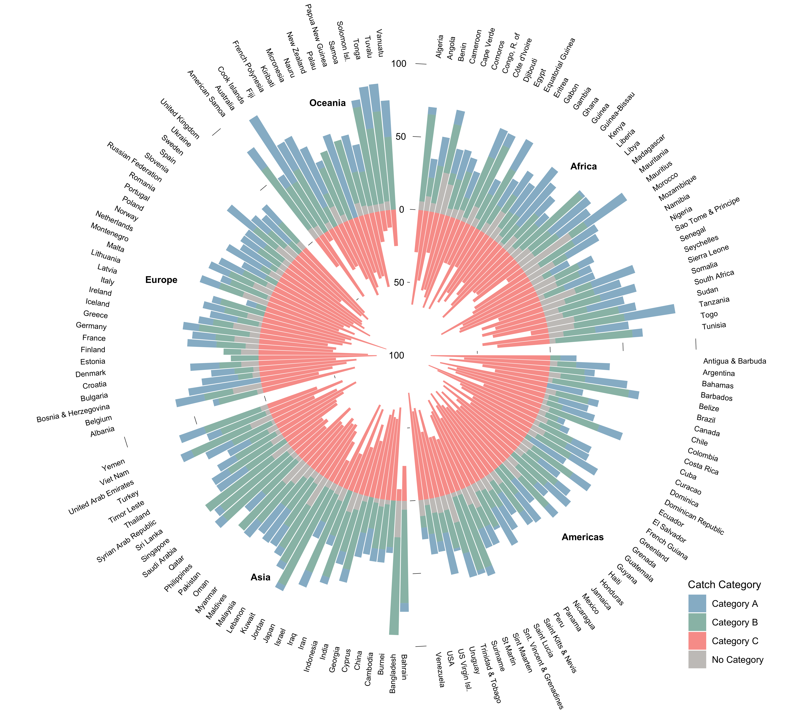

```{r setup, eval = T, echo=F, warning=F,message=F, results='hide'}

library(MyFunctions)

#### Library ####
packages <- c(
  "dplyr", # Data manipulation
  "knitr",
  "kableExtra",
  "png",
  "grid",
  "janitor"
)

my_lib(packages)

```

# Supplementary Figures

```{r Call_Sup_1, eval = T, fig.width = 12, fig.height = 10, echo=FALSE, fig.pos= "H", fig.cap="Number of transboundary species per EEZ and their contributions to countries’ EEZ catch. The number of species is displayed in the EEZ while catch (in thousand tonnes) is displayed in the land polygon."}

img <- readPNG("../Figures/FigS1.png")
grid.raster(img)
```

<!--  -->

\clearpage

The number of grid cells in which a species is present (*Area Index*) is expected to directly influence whether or not a species is considered transboundary. Therefore, we tested the sensitivity of our results to the *Area Index* by estimating the number of transboundary species along a gradient of values (Supplementary Fig. S2). As expected, using a more relaxed value (e.g. the species is present within 10% or more of the EEZ) will result in a greater number of transboundary species (median of 40 EEZs shared per species), while a more restrictive value (e.g., 50%) results in a median estimate of 4. The current analysis utilized a 25% *Area Index* threshold (Supplementary Fig. S2 - darker histogram).

```{r Call_Sup_4, eval = T, fig.width=6, fig.height=9, echo=FALSE, fig.pos= "H", fig.cap=" Histogram of number of transboundary species using different Area Index threshold values. The darker histogram represents the threshold (25%) used in the present analysis"}

img <- readPNG("../Figures/FigS2.png")
grid.raster(img)
```

<!--  -->
  
\clearpage

# Supplementary Tables


```{r Call_SupT_1, eval = T, echo = F, fig.pos= "H"}

read.csv("~/GitHub/FishForVisa/Tables/Table_S1.csv") %>% 
  clean_names() %>% 
  filter(sub_region != "Other") %>% 
  arrange(sub_region) %>% 
  rename("UN sub region" = sub_region,
         "Area of EEZs (Km^2)" = size_entity_sum) %>% 
  kable("latex",
        booktabs = T,
        caption= "Size of all the EEZs in each sub region determined by the United Nations") %>% 
  kable_styling(full_width = T)

```

```{r Call_SupT_2, eval = T, echo = F, fig.pos= "H", message = F, warning = F}

# read.csv("~/GitHub/FishForVisa/Tables/Table_S2.csv") %>% 
#   clean_names() %>% 
#   rename(
#     Category = category,
#     "Mean (s.d.) Transboundary" = mean_shared,
#     "Mean (s.d.) Discrete" = mean_discrete) %>% 
#   kable("latex",
#         booktabs = T,
#         caption= "Average (standard deviation) number of transboundary and discrete species per EEZ for each catch trend category")

read.csv("~/GitHub/FishForVisa/Tables/Table_S2.csv") %>% 
  clean_names() %>% 
  mutate(
    "Mean shared" = paste(round(mean_value_x,2)," \u00B1 (",round(sd_value_x,2),")",sep=""),
    "Mean not-shared" = paste(round(mean_value_y,2)," \u00B1 (",round(sd_value_y,2),")",sep="")
  ) %>%
  select(1,8:9) %>%
  filter(observation != "No Category") %>%
  rename(Category = observation) %>%
  arrange(Category) %>% 
  kable("latex",
        booktabs = T,
        caption= "Average \u00B1 (standard deviation) number of shared and non-shared transboundary species per EEZ for each catch trend category")

```